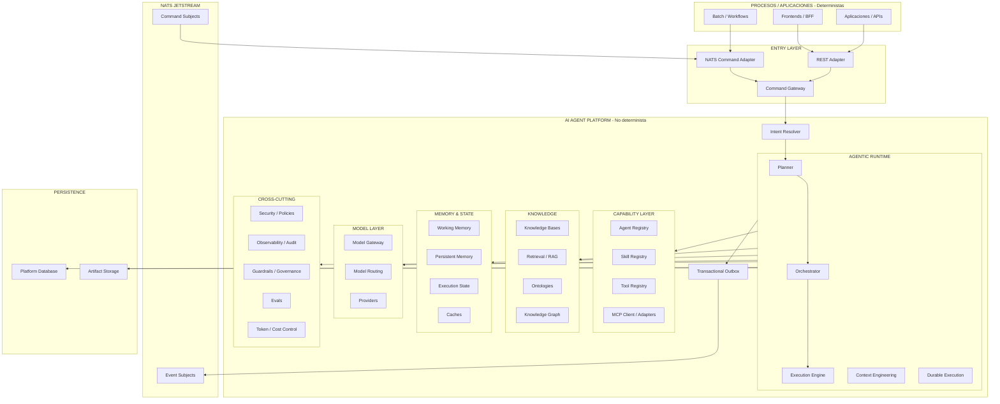
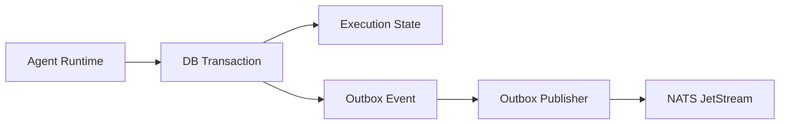

# Arquitectura de AI Agent Platform

## 1. Objetivo

AI Agent Platform es una **plataforma genérica orientada a intención** para resolver objetivos mediante IA sin acoplar a las aplicaciones consumidoras con agentes concretos, prompts, modelos, RAG, MCP, tools ni estrategias de orquestación. Los agentes son uno de los posibles mecanismos de ejecución de la plataforma, no la abstracción principal que ésta expone.

La frontera arquitectónica principal separa dos mundos:

- **Procesos y aplicaciones deterministas**: sistemas consumidores que solicitan una capacidad y trabajan con contratos estables.
- **Plataforma agéntica no determinista**: interpreta la intención, construye el contexto, decide la estrategia de ejecución y produce resultados.

Principio fundamental:

> Las aplicaciones expresan **QUÉ quieren conseguir**. La plataforma decide **CÓMO conseguirlo**.

Una nueva capacidad de negocio no debe implicar un nuevo contrato de integración.

---

## 2. Principios arquitectónicos

### 2.1 Contratos genéricos: evitando acoplamiento a procesos y aplicaciones

Como he comentado, la plataforma tiene la intencion de ser genérica y de que se puedan construir sobre ella las diferentes capas de negocio concreto. Por este motivo, no expone contratos específicos acoplados a un caso de negocio particular (ej:  `AnalyseProposalCommand`, `GenerateArchitectureCommand` o `ReviewCodeCommand`)

La entrada se normaliza como un `ExecutionCommand`. El caso de uso de negocio solicitado se representa como datos:

- `command.name`: etiqueta semántica machine-readable que describe el tipo de intención y puede utilizarse como hint, para observabilidad, políticas o métricas. No actúa como routing key hacia una implementación concreta.
- `intent`: objetivo expresado en lenguaje natural.
- `input`: datos estructurados sobre los que trabajar.
- `context`: contexto adicional conocido por el consumidor. Este dato es opcional
- `instructions`: aclaraciones o restricciones específicas de la ejecución. Este dato es opcional

Ejemplos de `command.name`:

- `analyse-proposal`
- `generate-architecture`
- `review-code`
- `prepare-presentation`

El nombre de comando describe semánticamente la intención, pero **no identifica ni una implementación, ni una capability registrada, ni un agente**. La plataforma no debe resolver el comando mediante mappings de negocio del tipo `analyse-proposal -> ProposalAnalysisCapability`.

### 2.2 Independencia del transporte

Como hemos visto en el punto anterior, el modelo de entrada es genérico, independientemente del canal de entrada. 
REST y NATS son adaptadores de transporte. Ambos deben mapear al mismo modelo canónico interno.

```text
REST Adapter ──┐
               ├──> ExecutionCommand ──> Command Gateway
NATS Adapter ──┘
```

No existirán dos caminos funcionales diferentes para REST y mensajería.

### 2.3 Commands in / Events out: manejando la latencia

En el caso de operaciones con agentes tenemos que tener muy en cuenta que son operaciones no deterministas y que la latencia puede variar bastante. Por este motivo, la entrada puede ser síncrona o asíncróna pero la respuesta siempre va a ser asíncróna:

- **Entrada de comandos**: REST o NATS JetStream.
- **Salida de ejecución**: siempre mediante eventos publicados en NATS JetStream.
- **Consultas**: REST para leer estado, ejecuciones y artifacts.

La aceptación de un comando no implica su finalización. Una llamada REST de escritura debe responder con `202 Accepted` y devolver los identificadores necesarios para seguir la ejecución.

### 2.4 Encapsulación de la inteligencia

Los consumidores de la plataforma no deberían conocer:

- agentes concretos;
- prompts;
- skills;
- herramientas;
- MCP servers;
- modelos;
- RAG;
- memoria;
- estrategia de planificación;
- número de pasos.

Una misma intención puede resolverse internamente con una tool directa, una skill, un agente, varios agentes, RAG, una combinación de estos recursos o incluso una operación determinista, sin cambiar el contrato externo. El consumidor enviará un comando (es decir, una intención, el QUÉ) y la plataforma se encarga del CÓMO. El usuario sí que dispone de campos en el mensaje de comando, como "context" e "instructions", en los que puede indicar ciertas recomendaciones o restricciones en la ejecución del CÓMO.

Principio adicional:

> **The platform is intent-driven, not workflow-driven and not agent-driven.**

Y, como consecuencia:

> **Agents are an execution mechanism, not the abstraction exposed by the platform.**

### 2.6 Trazabilidad extremo a extremo

Todos los mensajes deben incluir identificadores que permitan reconstruir la cadena causal:

- `messageId`
- `executionId`
- `correlationId`
- `causationId`

### 2.7 Durable delivery

Los comandos y eventos relevantes utilizarán **NATS JetStream**, no únicamente Core NATS, para disponer de persistencia, acknowledgements, redelivery y replay. Esto permite que si hay un fallo de la plataforma a nivel de infraestructura se pueda retomar el proceso en cuanto la plataforma vuelva a estar operativa.

---

## 3. Vista lógica de la plataforma



---

## 4. Componentes

### 4.1 REST Adapter

Expone la entrada síncrona para consumidores HTTP.

Responsabilidades:

- autenticación y autorización de transporte;
- validación sintáctica;
- deserialización;
- traducción al `ExecutionCommand` canónico;
- aceptación de la solicitud;
- devolución de `202 Accepted`.

No contiene lógica de orquestación ni lógica específica de casos de uso.

### 4.2 NATS Command Adapter

Consume comandos desde NATS JetStream y los traduce al mismo `ExecutionCommand` utilizado por REST.

Responsabilidades:

- durable consumer;
- ack/nack;
- deduplicación;
- validación del envelope;
- propagación de correlation y causation IDs;
- traducción al modelo interno.

### 4.3 Command Gateway

Punto de entrada único al dominio de ejecución.

Responsabilidades:

- validar semánticamente el comando;
- aplicar idempotencia;
- crear o localizar la `Execution`;
- entregar la intención normalizada al `Intent Resolver`;
- iniciar el procesamiento asíncrono.

El gateway no debe conocer detalles de agentes o proveedores LLM.

### 4.4 Intent Resolver

Interpreta semánticamente el `ExecutionCommand` y determina **qué debe conseguir la plataforma**.

Para resolver la intención utiliza conjuntamente:

- `command.name`, cuando exista, como hint semántico;
- `intent`;
- `input`;
- `context`;
- `instructions`.

No realiza routing mediante reglas de negocio predefinidas ni mappings del tipo:

```text
analyse-proposal -> ProposalAnalysisHandler
```

o:

```text
analyse-proposal -> ProposalAnalysisCapability
```

El `Intent Resolver` construye una representación normalizada de la intención y la entrega al planner. El contrato externo no determina la estrategia de ejecución.

Ejemplo conceptual:

```text
ExecutionCommand
      |
      v
Intent Resolver
      |
      v
Normalized Intent
      |
      v
Execution Planner
```

El `command.name` puede ser útil para trazabilidad, observabilidad, políticas, métricas o como pista semántica, pero nunca debe forzar la selección de un agente, workflow o capability concreta.

### 4.5 Agentic Runtime

Es el núcleo de ejecución.

Contiene:

- planificación;
- orquestación;
- ejecución de agentes;
- administración de pasos;
- gestión del contexto;
- durable execution;
- control de errores y reintentos.

### 4.6 Planner

Decide dinámicamente **cómo resolver la intención** a partir de los recursos disponibles en la plataforma.

Puede determinar que la ejecución requiera:

- una llamada directa a una tool;
- una skill;
- un agente;
- varias tools;
- una combinación de tool + agente;
- RAG + agente;
- múltiples agentes;
- un plan multi-step;
- una operación determinista si no es necesario utilizar un agente.

Puede generar un plan lineal, paralelo o dinámico. Para ello descubre los recursos disponibles a través de los registries de agentes, skills, tools, conocimiento y modelos.

No debe existir un workflow de negocio obligatorio asociado a `command.name`. Dos ejecuciones con una intención equivalente pueden utilizar estrategias diferentes si el contexto, los recursos disponibles o las políticas de la plataforma cambian.

### 4.7 Orchestrator

Coordina la ejecución del plan:

- orden de pasos;
- dependencias;
- ejecución paralela;
- invocación de agentes;
- invocación de skills y tools;
- manejo de resultados parciales;
- revisión o iteración cuando proceda.

### 4.8 Execution Engine

Ejecuta unidades concretas de trabajo y mantiene el modelo de estado de la `Execution`.

Debe soportar progresivamente:

- retries;
- timeouts;
- pause/resume;
- cancelación;
- human approval;
- recovery tras reinicio.

### 4.9 Context Engineering

Construye el contexto efectivo de cada llamada a un modelo a partir de:

- intención;
- input;
- instrucciones;
- contexto del consumidor;
- memoria;
- conocimiento recuperado;
- resultados de tools;
- políticas;
- skills;
- estado de la ejecución;
- presupuesto de tokens.

El consumidor proporciona intención e información; **no construye el prompt final**.

### 4.10 Agent Registry

Catálogo versionado de agentes.

Un agente define, como mínimo:

- identidad;
- rol;
- objetivo;
- instrucciones base;
- skills permitidas;
- tools permitidas;
- políticas;
- requisitos de modelo.

### 4.11 Skill Registry

Catálogo de capacidades reutilizables de razonamiento o procedimiento.

Una skill expresa **cómo realizar una tarea**, pero no necesariamente ejecuta una acción externa.

Ejemplos:

- diseño de APIs;
- revisión de arquitectura;
- análisis de requisitos;
- generación de ADR.

### 4.12 Tool Registry / Tool Runtime

Abstracción para capacidades ejecutables externas.

Un agente debe invocar una tool por capacidad lógica, sin depender del mecanismo técnico de integración.

Una tool puede implementarse mediante:

- código nativo;
- API REST;
- SDK;
- MCP.

### 4.13 MCP

MCP se considera un mecanismo de integración dentro de la Tool Layer, no una capacidad de negocio.

La plataforma es responsable de:

- descubrimiento;
- conexión con MCP servers;
- exposición de tools al runtime;
- validación;
- observabilidad;
- políticas de acceso.

Las aplicaciones consumidoras no interactúan directamente con MCP.

### 4.14 Knowledge Layer

Abstracción de conocimiento de la plataforma.

Incluye:

- fuentes documentales;
- ingestión;
- parsing;
- chunking;
- embeddings;
- índices;
- retrieval;
- búsqueda híbrida;
- reranking;
- RAG;
- metadatos;
- ontologías;
- knowledge graph.

RAG es una técnica dentro de esta capa, no la capa completa.

### 4.15 Ontologies / Semantic Layer

Define conceptos y relaciones del dominio para mejorar recuperación, normalización y razonamiento.

No es obligatoria para todas las capacidades y se incorporará de forma incremental.

### 4.16 Memory & State

Separa explícitamente:

- **Working Memory**: contexto temporal de una ejecución.
- **Session Memory**: información mantenida en una sesión lógica.
- **Persistent Memory**: conocimiento reutilizable entre ejecuciones.
- **Execution State**: estado durable del workflow.
- **Cache**: optimización técnica.

Cache no equivale a memoria.

### 4.17 Model Gateway

Evita que agentes y runtime dependan directamente de proveedores concretos.

Responsabilidades:

- abstracción de proveedores;
- routing;
- fallback;
- retries;
- timeouts;
- structured outputs;
- capacidades de modelos;
- token accounting;
- control de coste;
- rate limiting.

### 4.18 Observability, Governance & Evals

Capacidades transversales:

- distributed tracing;
- métricas;
- logs;
- auditoría;
- lineage;
- versionado;
- seguridad;
- autorización;
- guardrails;
- políticas;
- consumo de tokens;
- costes;
- evaluación de calidad.

Debe ser posible reconstruir por qué una ejecución tomó una decisión y qué información utilizó.

---

## 5. Modelo de ejecución

La entidad central es `Execution`.

Estados iniciales propuestos:

```text
ACCEPTED
   |
   v
PLANNING
   |
   v
RUNNING
   |
   +--> WAITING
   |       |
   |       v
   |     RUNNING
   |
   +--> COMPLETED
   |
   +--> FAILED
   |
   +--> CANCELLED
```

Una ejecución puede contener:

- steps;
- agent executions;
- tool calls;
- retrieved knowledge;
- artifacts;
- metrics;
- errors;
- emitted events.

---

## 6. Modelo de comunicación

### 6.1 Entrada

Los comandos pueden entrar por:

- REST;
- NATS JetStream.

Ambos producen el mismo `ExecutionCommand`.

### 6.2 Salida

La plataforma publica siempre resultados y lifecycle mediante NATS JetStream.

Familias conceptuales:

- `ExecutionLifecycleEvent`
- `ExecutionResultEvent`
- `ArtifactProducedEvent`

Los consumidores no reciben eventos específicos del caso de uso como contratos diferentes; el detalle de la capacidad va dentro del payload estándar.

### 6.3 Queries

REST se mantiene para lectura:

- `GET /executions/{id}`
- `GET /executions/{id}/events`
- `GET /executions/{id}/artifacts`
- `GET /artifacts/{id}`

Esto da un modelo próximo a CQRS:

```text
Commands -> REST / NATS
Events   -> NATS
Queries  -> REST
```

---

## 7. NATS JetStream

Se recomienda separar al menos conceptualmente comandos y eventos:

```text
PLATFORM_COMMANDS
  subjects:
    platform.commands.>

PLATFORM_EVENTS
  subjects:
    platform.events.>
```

La estrategia definitiva de subjects, streams, consumers y retention deberá documentarse antes de producción.

JetStream aporta:

- persistencia;
- at-least-once delivery;
- acknowledgements;
- redelivery;
- replay;
- consumers durables.

Por ser at-least-once, los consumidores y la propia plataforma deben ser idempotentes.

---

## 8. Transactional Outbox

### 8.1 Problema

Una transición de estado y la publicación de su evento no forman una transacción distribuida.

Ejemplo incorrecto:

```text
1. UPDATE execution SET status = 'COMPLETED'
2. publish execution.completed to NATS
```

Si la aplicación cae entre 1 y 2, la base de datos indica `COMPLETED`, pero el evento nunca se publica.

El orden inverso tiene el problema simétrico: el evento puede existir aunque el estado no se haya persistido.

### 8.2 Solución

Aplicar **Transactional Outbox**.

Dentro de la misma transacción local:

```text
BEGIN

UPDATE execution ...

INSERT INTO outbox_event ...

COMMIT
```

Después, un publisher independiente publica los registros pendientes en NATS JetStream.



### 8.3 Semántica

El patrón garantiza **eventual publication**, no exactly-once delivery extremo a extremo.

Pueden existir reintentos o duplicados, por lo que:

- cada evento tiene `messageId` único;
- los consumidores deben ser idempotentes;
- el publisher registra estado de publicación;
- la deduplicación no debe depender exclusivamente del broker.

### 8.4 Implementación inicial

Para la primera versión puede utilizarse:

- PostgreSQL para estado y tabla outbox;
- publisher periódico o reactivo;
- publicación a JetStream;
- marcación del evento como publicado.

Más adelante puede sustituirse el publisher por CDC si aporta valor, sin modificar los contratos externos.

---

## 9. Idempotencia

La entrada puede sufrir redelivery tanto por NATS como por reintentos HTTP.

La plataforma debe distinguir:

- `messageId`: identifica un mensaje concreto;
- `executionId`: identifica una ejecución;
- `correlationId`: agrupa una interacción o proceso;
- `causationId`: identifica el mensaje que causó el actual.

El gateway debe disponer de una política de idempotencia para impedir ejecuciones duplicadas cuando el mismo comando es reenviado.

---

## 10. Artifacts

Un resultado grande no debe viajar necesariamente embebido en NATS.

La plataforma utiliza el concepto de `Artifact` para resultados como:

- documentos Markdown;
- JSON extensos;
- código;
- imágenes;
- presentaciones;
- informes;
- archivos comprimidos.

El evento contiene metadata y referencia al artifact.

Esto evita:

- mensajes excesivamente grandes;
- duplicación;
- problemas de replay;
- acoplamiento al tamaño máximo del broker.

---

## 11. Control Plane y Runtime Plane

### Control Plane

Gestiona definiciones y configuración de los **recursos disponibles para resolver intenciones**:

- agents;
- skills;
- tools;
- MCP servers;
- knowledge bases;
- models;
- prompts;
- policies;
- versions.

### Runtime Plane

Gestiona ejecuciones:

- command processing;
- planning;
- orchestration;
- agents;
- tool calls;
- retrieval;
- memory;
- state;
- artifacts;
- events.

La UI administrativa trabaja principalmente sobre el Control Plane.

---

## 12. Decisiones a preservar

1. El contrato externo es genérico.
2. `command.name` es una etiqueta semántica/hint de la intención; no identifica una capability, workflow, handler o agente concreto.
3. REST y NATS convergen en el mismo modelo interno.
4. La salida funcional es siempre event-driven mediante NATS JetStream.
5. Las queries pueden realizarse mediante REST.
6. La ejecución es asíncrona y durable.
7. Los resultados grandes se modelan como artifacts.
8. Estado y eventos se mantienen consistentes mediante Transactional Outbox.
9. La plataforma, no el consumidor, administra prompts, agentes, RAG, MCP y modelos.
10. Añadir una nueva intención o caso de uso no implica añadir un nuevo contrato de integración ni un mapping de negocio dentro de la plataforma.
11. La plataforma es intent-driven: decide dinámicamente si resolver una intención mediante tools, skills, agentes, RAG, múltiples recursos o una operación determinista.
12. Los agents son mecanismos internos de ejecución, no la abstracción expuesta a los consumidores.

---

## 13. Architecture Decision Records (ADRs)

Esta sección registra decisiones tomadas durante la evolución de la plataforma, incluyendo el problema que las originó, la decisión, alternativas y consecuencias. Su objetivo es preservar el razonamiento arquitectónico y servir como material de referencia para futuras evoluciones y documentación técnica.

### ADR-001 — Tool es la abstracción; MCP es un mecanismo de integración

**Estado:** Accepted  
**Contexto:** M2 — Tools & MCP

#### Contexto

La plataforma necesita acceder a APIs, SDKs, servicios internos, Google Workspace y otros sistemas. Exponer MCP directamente al planner habría introducido conceptos técnicos como MCP server, JSON-RPC, stdio o tools/call dentro del modelo cognitivo.

#### Decisión

La abstracción estable del runtime es **Tool**. Una Tool representa una capacidad lógica ejecutable con nombre, descripción, instrucciones, input schema, políticas e implementación técnica. La implementación puede ser MCP, REST, SDK o código nativo.

```text
Planner / Agent
      |
      v
     Tool
      |
      +--> MCP adapter
      +--> REST adapter
      +--> SDK adapter
      +--> Native adapter
```

MCP queda encapsulado dentro de la Tool Layer y no forma parte del contrato externo de la plataforma.

#### Consecuencias

- El planner no depende de MCP.
- Sustituir MCP por REST no cambia el contrato lógico de la tool.
- Los consumidores externos no conocen el protocolo de integración.
- Las políticas y observabilidad pueden aplicarse sobre Tools de forma homogénea.

---

### ADR-002 — Provider response no equivale a Tool Result

**Estado:** Accepted  
**Contexto:** M2 — Google Workspace  
**Incidente:** resumen de un Google Docs.

#### Contexto

La primera integración usó docs_get_document y propagó el JSON completo de Google Docs API hasta el contexto del modelo. Ese JSON contiene índices, estilos, estructuras internas, metadatos y otros datos del proveedor que no aportan valor para un resumen.

En una ejecución real, este diseño produjo:

```text
222227 tokens > 200000 maximum
```

El problema no era LiteLLM. Tampoco era simplemente el tamaño del transporte MCP. El problema era haber confundido el contrato del proveedor con el contrato semántico que necesita el runtime.

#### Decisión

Las Tools deben exponer resultados **semánticos, compactos y orientados a la intención**.

Para Google Docs se mantienen dos capacidades:

```text
docs_get_document
    -> representación estructurada completa
    -> útil si se necesita estructura, layout o metadata

docs_get_text
    -> documentId + title + text + characterCount
    -> preferida para summarization / analysis / LLM reasoning
```

La plataforma registra `google-docs-get-text` y el router M2 v2 debe preferirla para resumen y análisis.

#### Regla general

> **Provider response != Tool contract.**

El adapter/tool decide qué información atraviesa la frontera hacia el runtime cognitivo.

#### Consecuencias

- menor consumo de tokens;
- menor latencia y coste;
- menor riesgo de superar la context window;
- menos ruido semántico;
- menor acoplamiento al proveedor;
- pueden coexistir varias Tools sobre una misma API, cada una con un contrato distinto.

#### Alternativas descartadas

- Aumentar la ventana de contexto: desplaza el problema y aumenta coste/latencia.
- Configurar sólo un context-window fallback en LiteLLM: útil como resiliencia, pero no corrige un contrato ineficiente.
- Enviar siempre el JSON completo: descartado por coste, ruido y falta de control.

---

### ADR-003 — Separar límite de transporte de presupuesto de contexto

**Estado:** Accepted  
**Contexto:** M2

#### Contexto

Durante la misma prueba aparecieron dos fallos distintos. Primero el cliente MCP stdio alcanzó el límite interno de lectura de asyncio y produjo:

```text
Separator is not found, and chunk exceed the limit
```

Después de permitir mensajes MCP mayores, el modelo rechazó el prompt por superar su context window.

#### Decisión

Se consideran explícitamente dos presupuestos independientes:

```text
Transport Budget != Model Context Budget
```

`MCP_MAX_MESSAGE_BYTES` responde a si la plataforma puede transportar correctamente el resultado.

`MAX_TOOL_RESULT_CHARS_FOR_MODEL` actúa como safety rail antes de inyectar un Tool Result en un prompt. No sustituye token accounting real; evita enviar resultados obviamente desproporcionados.

#### Consecuencias

Que un resultado pueda transportarse no significa que deba entrar completo en el contexto del modelo. Context Engineering deberá aplicar progresivamente selección, proyección, reducción, chunking, summarization intermedia, retrieval y token budgeting.

En M3, documentos grandes evolucionarán hacia parsing/chunking/RAG en lugar de transportarse siempre completos.

---

### ADR-004 — El adapter MCP normaliza el resultado protocolario

**Estado:** Accepted  
**Contexto:** M2

#### Contexto

MCP devuelve una envolvente protocolaria, por ejemplo `content`, `structuredContent` e `isError`. Propagar esa envolvente directamente obliga al runtime a conocer MCP y añade datos sin valor al contexto.

#### Decisión

El adapter MCP normaliza el resultado antes de entregarlo como Tool Result:

1. usar `structuredContent` cuando exista;
2. si hay un único bloque de texto con JSON válido, parsearlo;
3. si es texto plano, devolver texto;
4. conservar otros contenidos únicamente cuando sean necesarios.

```text
MCP envelope -> MCP Adapter -> normalized Tool Result -> Runtime
```

#### Consecuencias

- Business/runtime no conoce detalles del envelope MCP.
- Se reducen tokens de infraestructura.
- La metadata técnica queda separada del contenido semántico.
- Cambiar de protocolo no debería cambiar el contrato lógico de la Tool.

---

### ADR-005 — La BBDD prevalece sobre bootstrap Markdown

**Estado:** Accepted  
**Contexto:** M1/M2

Agents, Skills, Prompts, Tools y MCP Servers pueden declararse en Markdown, pero también modificarse desde API/UI.

#### Decisión

El bootstrap es **insert-if-missing**:

```text
Markdown existe + DB no existe -> INSERT
Markdown existe + DB existe    -> KEEP DATABASE VERSION
```

La base de datos es la source of truth en runtime.

#### Consecuencias

- Un restart no revierte cambios administrativos.
- Nuevos recursos bootstrap se incorporan sin alterar existentes.
- Evolucionar un recurso bootstrap existente requiere versionado/nuevo nombre o promoción explícita.
- Por ello el router actualizado se introduce como `intent-router-tools-v2` en vez de sobrescribir silenciosamente el prompt existente.

---

### ADR-006 — Separar modelo de routing y modelo de ejecución

**Estado:** Accepted  
**Contexto:** M1

Resolver una intención suele requerir menos capacidad que ejecutar la tarea final.

#### Decisión

El runtime usa perfiles lógicos `router-fast` y `reasoning-default`, resueltos por LiteLLM hacia modelos físicos. La lógica de negocio no conoce identificadores concretos de proveedor/modelo.

#### Consecuencias

- routing más rápido y económico;
- cambio de modelo/proveedor sin modificar business code;
- base para futuros perfiles de razonamiento, visión o embeddings.

---

### ADR-007 — Los errores deben ser diagnósticos y correlacionables

**Estado:** Accepted  
**Contexto:** M2

La primera versión persistía únicamente `reason: RuntimeError`, insuficiente para distinguir problemas de MCP, OAuth, Google API, validación, modelo, context window o persistencia.

#### Decisión

Los errores de ejecución incluyen `stage`, `exceptionType`, mensaje técnico acotado, `strategy`, `agent` y `tool`. Los logs conservan el stacktrace completo y OpenTelemetry registra la excepción asociada al `executionId`.

Etapas iniciales:

```text
BUILD_COMMAND
RESOLVE_INTENT
EXECUTE_TOOL
EXECUTE_MODEL
PERSIST_RESULT
```

#### Consecuencias

La API permite diagnóstico rápido sin exponer stacktraces completos; logs y traces preservan el detalle técnico.

---

### ADR-008 — Un documentId de Drive no implica Google Docs nativo

**Estado:** Accepted  
**Contexto:** M2; evolución prevista M3/M4

Una prueba inicial utilizó un Word almacenado en Drive con `docs_get_document`. Google respondió que la operación no estaba soportada para un Office file.

#### Decisión

No ocultar diferencias importantes de formato detrás de una llamada incorrecta a Google Docs API.

Para Google Docs nativo:

```text
docs_get_text
```

Para DOCX/PDF u otros binarios:

```text
Drive metadata -> download/export -> parser específico -> semantic document representation
```

La composición automática de varias Tools pertenece al Planner/Orchestrator multi-step de M4. La ingestión, parsing, chunking y retrieval documental a escala pertenece a M3 Knowledge/RAG.

---

## 14. Lecciones de M2 para Context Engineering

La prueba de resumen de Google Drive establece esta frontera:

```text
External Provider
      |
      v
Integration Protocol (MCP)
      |
      v
Tool Adapter
      |
      v
Semantic Tool Result
      |
      v
Context Engineering
      |
      v
Model Gateway
      |
      v
LLM
```

Responsabilidades:

- **Provider/API:** expone su modelo nativo.
- **MCP:** transporta capacidades y resultados.
- **Tool Adapter:** proyecta el modelo del proveedor a un contrato lógico.
- **Context Engineering:** decide qué parte merece entrar en contexto.
- **Model Gateway:** selecciona modelo y aplica routing, límites y coste.
- **LLM:** razona únicamente sobre el contexto finalmente preparado.

Reglas a preservar:

> **Que un dato pueda transportarse no significa que deba entrar completo en la ventana de contexto.**

> **Una integración técnicamente correcta puede ser arquitectónicamente incorrecta si propaga demasiado detalle hacia el modelo.**

Estas decisiones serán base explícita de M3 (Knowledge/RAG) y M4 (Agentic Orchestration).

---

## 15. M3 — Managed Knowledge / RAG

M3 convierte el conocimiento documental en un recurso gestionado de la plataforma. No se limita al caso de resumir documentos grandes: su objetivo principal es permitir que agentes y ejecuciones consulten documentación de referencia, políticas, arquitecturas, patrones, perfiles aprobados y reglas de validación.

### ADR-009 — Managed Knowledge es un recurso de primer nivel

**Estado:** Accepted  
**Contexto:** M3

#### Decisión

Se introduce `KnowledgeBase` como recurso administrado, independiente de agentes, tools y prompts. Una base de conocimiento puede contener múltiples documentos y ser utilizada por cualquier ejecución o asociada explícitamente a agentes.

Scopes soportados:

```text
EXECUTION
SESSION
USER
TENANT
GLOBAL
```

Políticas de retención:

```text
PERSISTENT
TTL
```

Esto permite utilizar el mismo pipeline tanto para conocimiento corporativo persistente como para conocimiento efímero de una ejecución.

#### Consecuencias

- RAG no implica persistencia permanente.
- La retención se decide independientemente de la técnica de retrieval.
- El conocimiento puede reutilizarse entre ejecuciones sin volver a parsear/embeber los documentos.
- Bases TTL se eliminan automáticamente junto con documentos y chunks.

---

### ADR-010 — Ingestar semánticamente, no convertir todo a PDF

**Estado:** Accepted

#### Contexto

Una opción era convertir cualquier formato entrante a PDF y utilizar un único parser. Esto simplifica el pipeline pero destruye estructura útil, especialmente en presentaciones y hojas de cálculo.

#### Decisión

Se utiliza parsing nativo siempre que sea razonable:

```text
PDF   -> PyMuPDF
DOCX  -> python-docx
PPTX  -> python-pptx
XLSX  -> openpyxl
CSV   -> parser CSV
TXT/MD/JSON -> parser nativo
```

Google Docs, Slides y Sheets utilizan proyecciones semánticas del MCP de Google Workspace.

LibreOffice se utiliza únicamente como fallback portable para formatos legacy/ODF:

```text
DOC / PPT / XLS / ODT / ODP / ODS
      -> LibreOffice headless
      -> PDF temporal
      -> extracción
```

LibreOffice forma parte de la imagen Docker de agent-platform; la ejecución no depende de software instalado en el host.

#### Consecuencias

- Se preservan páginas, slides, sheets y tablas como metadata de chunks.
- Se evita degradar hojas de cálculo a una representación visual antes del parsing.
- El fallback sigue siendo portable.

---

### ADR-011 — Retrieval híbrido semántico + lexical

**Estado:** Accepted

#### Decisión

Los chunks se almacenan en PostgreSQL con `pgvector` y full-text search.

Cada chunk contiene:

```text
content
metadata
embedding vector(768)
search_vector tsvector
```

La búsqueda combina similitud coseno y ranking lexical. Los embeddings se obtienen mediante una abstracción independiente `EmbeddingProvider`, desacoplada del Model Gateway.

Implementación portable por defecto:

```text
Knowledge Service
      -> EmbeddingProvider
      -> HashEmbeddingProvider
      -> vector(768)
```

#### Consecuencias

- El business code no depende de un proveedor/modelo concreto.
- El runtime local no necesita Ollama ni descargar modelos.
- El provider hash es válido para desarrollo/integración, no como garantía de calidad semántica productiva.
- Un provider cloud/real puede sustituirlo manteniendo el contrato `EmbeddingProvider`.
- La dimensión de embedding actual (768) forma parte del esquema de almacenamiento M3 y requerirá migración si cambia el provider por otro de dimensión diferente.

---

### ADR-012 — El ciclo de vida del documento es explícito y reindexable

**Estado:** Accepted

#### Decisión

Los documentos tienen estado de ingestión:

```text
PENDING -> INDEXING -> READY
                   -> FAILED
```

La creación de un documento sólo registra la fuente. Un worker de Knowledge procesa parsing, chunking, embeddings e indexado.

Actualizar un fichero subido incrementa su versión y reconstruye todos sus chunks. Para fuentes Google, `reindex` vuelve a leer la fuente actual por su ID. Eliminar un documento elimina por cascade sus chunks y elimina el binario local cuando exista.

#### Consecuencias

- El lifecycle es observable.
- Una actualización no mezcla chunks de versiones antiguas y nuevas.
- El origen (`sourceType + sourceId`) identifica fuentes Google dentro de una KB.
- M5 podrá hacer durable el proceso de ingestión sin cambiar el modelo externo.

---

### ADR-013 — Knowledge puede actuar como REFERENCE o GUARDRAIL

**Estado:** Accepted

#### Contexto

El conocimiento no siempre se utiliza del mismo modo. Una arquitectura de referencia orienta una solución; un catálogo de perfiles permitidos o una política de seguridad debe funcionar como restricción.

#### Decisión

Las asignaciones Agent -> KnowledgeBase incluyen `usageMode`:

```text
REFERENCE
GUARDRAIL
```

`REFERENCE` aporta grounding, ejemplos y contexto.

`GUARDRAIL` indica que los fragmentos recuperados contienen reglas/constraints contra los que debe contrastarse la solución o el input que se está validando.

El runtime M3 soporta:

```text
RAG_LLM
AGENT_RAG_LLM
AGENT_TOOL_RAG_LLM
```

Los resultados registran las bases utilizadas y metadata de los retrieval hits para trazabilidad.

#### Límite de M3

M3 permite generación grounded y validación explícita contra conocimiento. Una validación automática multi-step del tipo `generar -> recuperar reglas -> validar -> reparar` pertenece a M4 Agentic Orchestration.

---

### ADR-014 — Conocimiento efímero y conocimiento persistente comparten pipeline

**Estado:** Accepted

#### Decisión

No se implementan dos RAG distintos. Una KB persistente y una KB efímera usan el mismo pipeline:

```text
source
  -> parse
  -> chunk
  -> embed
  -> index
  -> retrieve
```

La diferencia está en scope y retention:

```text
Reference architecture KB:
  scope = TENANT
  retention = PERSISTENT

One-off huge document:
  scope = EXECUTION
  retention = TTL
```

Un cleanup worker elimina las KB TTL expiradas.

#### Evolución M4

El Planner + Feasibility Engine podrá crear automáticamente una KB efímera cuando detecte que un documento requerido para una ejecución excede el presupuesto de contexto directo.

---

### ADR-015 — El RAG pertenece a la plataforma, no al agente

**Estado:** Accepted

#### Decisión

Los agentes pueden declarar/asociar qué bases de conocimiento les resultan relevantes, pero no implementan por sí mismos vector stores, chunking, embeddings ni retrieval.

```text
Agent
   -> logical knowledge assignment
Platform Knowledge Layer
   -> ingestion
   -> indexing
   -> retrieval
   -> context construction
```

#### Consecuencias

- Distintos agentes reutilizan el mismo conocimiento.
- Las políticas de retención y seguridad se centralizan.
- Cambiar pgvector, embeddings o estrategia de retrieval no obliga a modificar agentes.
- El conocimiento recuperado es trazable como parte de la ejecución.

---

### M3: pipeline implementado

```text
                  +---------------------------+
Upload ---------->| Native Document Parsers   |
                  +---------------------------+
                               |
Google Docs/Slides/Sheets -> MCP semantic readers
                               |
                               v
                       ParsedDocument
                               |
                               v
                 per-KB chunking policy
                               |
                               v
                    EmbeddingProvider
                               |
                               v
                  PostgreSQL + pgvector + FTS
                               |
                               v
                       Hybrid Retrieval
                               |
                               v
                    Context Engineering
                               |
                               v
                        Agent / LLM
```

Formatos iniciales:

- PDF
- DOCX
- PPTX
- XLSX
- CSV
- TXT / Markdown / JSON
- Google Docs
- Google Slides
- Google Sheets
- DOC/PPT/XLS/ODT/ODP/ODS mediante fallback LibreOffice.

El almacenamiento binario local está montado como volumen Docker `/data/knowledge`, separado de PostgreSQL. Los chunks, embeddings, metadata y lifecycle permanecen en PostgreSQL.


---

### ADR-016 — Embeddings desacoplados del Model Gateway y sin dependencia obligatoria de Ollama

**Estado:** Accepted  
**Contexto:** M3 — revisión de portabilidad local

#### Contexto

La primera implementación de M3 resolvía embeddings mediante:

```text
Knowledge Service
  -> LiteLLM
  -> embedding-default
  -> Ollama
  -> nomic-embed-text-v2-moe
```

Aunque la abstracción lógica era correcta, el runtime local quedaba obligado a descargar y ejecutar una imagen pesada de Ollama. En entornos de desarrollo con Docker/Colima esto introduce consumo significativo de disco y memoria y puede impedir incluso arrancar la plataforma.

La rama `feat/agent-platform-integration` de `proposal-app` ya utilizaba una abstracción específica de embedding con un provider hash determinista y sin credenciales para desarrollo/integración.

#### Decisión

Embeddings dejan de formar parte de `ModelGatewayPort`.

Se introduce una abstracción independiente:

```text
EmbeddingProvider
  - provider_key
  - model
  - dimensions
  - embed(texts)
```

El runtime portable por defecto usa:

```text
HashEmbeddingProvider
model = hash-embedding-v1
dimensions = 768
```

No necesita:

- Ollama;
- GPU;
- CUDA;
- descarga de modelos;
- credenciales adicionales.

LiteLLM vuelve a dedicarse únicamente a modelos generativos.

#### Consecuencias

Positivas:

- el `docker-compose` local deja de incluir Ollama;
- M3 puede arrancar en máquinas con recursos limitados;
- embeddings y modelos generativos evolucionan independientemente;
- sustituir el provider hash por Bedrock, OpenAI, Vertex AI u otro proveedor requerirá un adapter de `EmbeddingProvider`, no cambios en ingestión/retrieval.

Trade-off:

- `HashEmbeddingProvider` es apropiado para desarrollo, integración y pruebas funcionales;
- no ofrece la calidad semántica de un embedding model de producción;
- antes de considerar M3 productivo deberá añadirse al menos un provider remoto/real y evaluarlo con datasets de retrieval.

---

### ADR-017 — La estrategia de chunking pertenece a cada Knowledge Base

**Estado:** Accepted  
**Contexto:** M3

#### Contexto

La primera versión aplicaba globalmente un split por caracteres con tamaño y overlap configurados por variables de entorno.

Esto no representa bien la diversidad documental:

- una normativa se beneficia de párrafos/secciones;
- Markdown puede aprovechar headings;
- PDFs deben conservar fronteras de página;
- documentos grandes pueden requerir parent/child chunks.

#### Decisión

Cada `KnowledgeBase` almacena su propia `chunkingPolicy`.

Formato inicial:

```json
{
  "strategy": "PARAGRAPH",
  "chunkSize": 1600,
  "overlap": 200,
  "parentSize": 6000,
  "childSize": 1600,
  "childOverlap": 200
}
```

Las unidades de M3 actuales son **caracteres**, no tokens. El token accounting real pertenece a Context Engineering y podrá sustituir esta aproximación sin cambiar el contrato conceptual.

Estrategias soportadas:

```text
FIXED
PARAGRAPH
HEADING
PAGE
HIERARCHICAL
```

`HIERARCHICAL` genera parent chunks no embebidos y child chunks embebidos:

```text
Parent (~6000 chars)
   |
   +-- Child (~1600)
   +-- Child (~1600)
   +-- Child (~1600)
```

Los chunks mantienen metadata estructural procedente del parser (page, slide, sheet, table, etc.) además de metadata propia del chunker.

#### Consecuencias

- dos KB pueden usar estrategias diferentes;
- cambiar la política no requiere modificar código;
- un reindex aplica la política actual de la KB;
- la metadata de ingestión registra la política efectiva;
- la estrategia podrá evolucionar a token-aware/semantic chunking manteniendo el mismo modelo de configuración.

