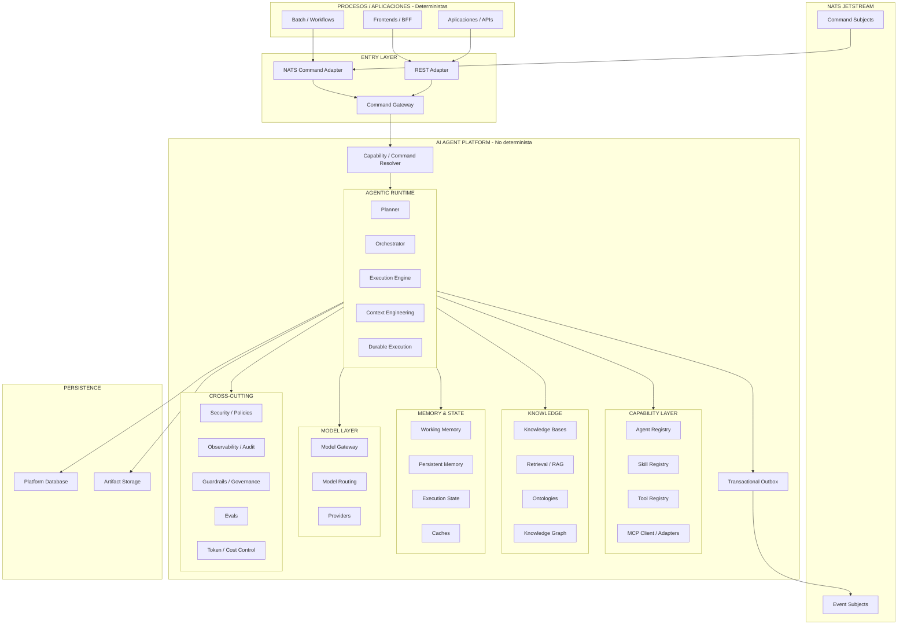
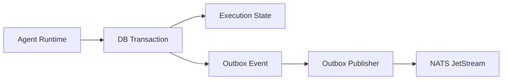

# Arquitectura de AI Agent Platform

## 1. Objetivo

AI Agent Platform es una plataforma genérica para ejecutar capacidades basadas en agentes de IA sin acoplar a las aplicaciones consumidoras con agentes concretos, prompts, modelos, RAG, MCP ni estrategias de orquestación.

La frontera arquitectónica principal separa dos mundos:

- **Procesos y aplicaciones deterministas**: sistemas consumidores que solicitan una capacidad y trabajan con contratos estables.
- **Plataforma agéntica no determinista**: interpreta la intención, construye el contexto, decide la estrategia de ejecución y produce resultados.

Principio fundamental:

> Las aplicaciones expresan **qué quieren conseguir**. La plataforma decide **cómo conseguirlo**.

Una nueva capacidad de negocio no debe implicar un nuevo contrato de integración.

---

## 2. Principios arquitectónicos

### 2.1 Contratos genéricos

La plataforma no expone contratos específicos como `AnalyseProposalCommand`, `GenerateArchitectureCommand` o `ReviewCodeCommand`.

La entrada se normaliza como un `ExecutionCommand`. El caso de uso solicitado se representa como datos:

- `command.name`: identificador estable y machine-readable de la capacidad.
- `intent`: objetivo expresado en lenguaje natural.
- `input`: datos estructurados sobre los que trabajar.
- `context`: contexto adicional conocido por el consumidor.
- `instructions`: aclaraciones o restricciones específicas de la ejecución.

Ejemplos de `command.name`:

- `analyse-proposal`
- `generate-architecture`
- `review-code`
- `prepare-presentation`

El nombre de comando identifica una **capacidad**, no un agente.

### 2.2 Independencia del transporte

REST y NATS son adaptadores de transporte. Ambos deben mapear al mismo modelo canónico interno.

```text
REST Adapter ──┐
               ├──> ExecutionCommand ──> Command Gateway
NATS Adapter ──┘
```

No existirán dos caminos funcionales diferentes para REST y mensajería.

### 2.3 Commands in / Events out

- **Entrada de comandos**: REST o NATS JetStream.
- **Salida de ejecución**: siempre mediante eventos publicados en NATS JetStream.
- **Consultas**: REST para leer estado, ejecuciones y artifacts.

La aceptación de un comando no implica su finalización. Una llamada REST de escritura debe responder con `202 Accepted` y devolver los identificadores necesarios para seguir la ejecución.

### 2.4 Asincronía por defecto

Las ejecuciones agénticas pueden durar segundos, minutos u horas. La plataforma no mantiene una petición HTTP abierta esperando el resultado final.

La unidad de trabajo durable es la **Execution**.

### 2.5 Encapsulación de la inteligencia

Los consumidores no conocen:

- agentes concretos;
- prompts;
- skills;
- herramientas;
- MCP servers;
- modelos;
- RAG;
- memoria;
- estrategia de planificación;
- número de pasos.

Una capacidad puede evolucionar internamente desde un único agente a una ejecución multiagente sin cambiar el contrato externo.

### 2.6 Trazabilidad extremo a extremo

Todos los mensajes deben incluir identificadores que permitan reconstruir la cadena causal:

- `messageId`
- `executionId`
- `correlationId`
- `causationId`

### 2.7 Durable delivery

Los comandos y eventos relevantes utilizarán **NATS JetStream**, no únicamente Core NATS, para disponer de persistencia, acknowledgements, redelivery y replay.

---

## 3. Vista lógica de la plataforma



---

## 4. Componentes

### 4.1 REST Adapter

Expone la entrada síncrona para consumidores HTTP.

Responsabilidades:

- autenticación y autorización de transporte;
- validación sintáctica;
- deserialización;
- traducción al `ExecutionCommand` canónico;
- aceptación de la solicitud;
- devolución de `202 Accepted`.

No contiene lógica de orquestación ni lógica específica de casos de uso.

### 4.2 NATS Command Adapter

Consume comandos desde NATS JetStream y los traduce al mismo `ExecutionCommand` utilizado por REST.

Responsabilidades:

- durable consumer;
- ack/nack;
- deduplicación;
- validación del envelope;
- propagación de correlation y causation IDs;
- traducción al modelo interno.

### 4.3 Command Gateway

Punto de entrada único al dominio de ejecución.

Responsabilidades:

- validar semánticamente el comando;
- aplicar idempotencia;
- crear o localizar la `Execution`;
- resolver la capacidad solicitada;
- iniciar el procesamiento asíncrono.

El gateway no debe conocer detalles de agentes o proveedores LLM.

### 4.4 Capability / Command Resolver

Resuelve `command.name` hacia una capacidad registrada en la plataforma.

Ejemplo:

```text
command.name = analyse-proposal
          |
          v
Capability Registry
          |
          v
proposal-analysis capability
          |
          v
Execution Strategy
```

La resolución puede evolucionar sin modificar el contrato externo.

### 4.5 Agentic Runtime

Es el núcleo de ejecución.

Contiene:

- planificación;
- orquestación;
- ejecución de agentes;
- administración de pasos;
- gestión del contexto;
- durable execution;
- control de errores y reintentos.

### 4.6 Planner

Decide, cuando una capacidad lo requiere, cómo descomponer un objetivo en pasos.

Puede generar un plan lineal, paralelo o dinámico.

No todas las ejecuciones necesitan planner; una capacidad sencilla puede ir directamente a una estrategia conocida.

### 4.7 Orchestrator

Coordina la ejecución del plan:

- orden de pasos;
- dependencias;
- ejecución paralela;
- invocación de agentes;
- invocación de skills y tools;
- manejo de resultados parciales;
- revisión o iteración cuando proceda.

### 4.8 Execution Engine

Ejecuta unidades concretas de trabajo y mantiene el modelo de estado de la `Execution`.

Debe soportar progresivamente:

- retries;
- timeouts;
- pause/resume;
- cancelación;
- human approval;
- recovery tras reinicio.

### 4.9 Context Engineering

Construye el contexto efectivo de cada llamada a un modelo a partir de:

- intención;
- input;
- instrucciones;
- contexto del consumidor;
- memoria;
- conocimiento recuperado;
- resultados de tools;
- políticas;
- skills;
- estado de la ejecución;
- presupuesto de tokens.

El consumidor proporciona intención e información; **no construye el prompt final**.

### 4.10 Agent Registry

Catálogo versionado de agentes.

Un agente define, como mínimo:

- identidad;
- rol;
- objetivo;
- instrucciones base;
- skills permitidas;
- tools permitidas;
- políticas;
- requisitos de modelo.

### 4.11 Skill Registry

Catálogo de capacidades reutilizables de razonamiento o procedimiento.

Una skill expresa **cómo realizar una tarea**, pero no necesariamente ejecuta una acción externa.

Ejemplos:

- diseño de APIs;
- revisión de arquitectura;
- análisis de requisitos;
- generación de ADR.

### 4.12 Tool Registry / Tool Runtime

Abstracción para capacidades ejecutables externas.

Un agente debe invocar una tool por capacidad lógica, sin depender del mecanismo técnico de integración.

Una tool puede implementarse mediante:

- código nativo;
- API REST;
- SDK;
- MCP.

### 4.13 MCP

MCP se considera un mecanismo de integración dentro de la Tool Layer, no una capacidad de negocio.

La plataforma es responsable de:

- descubrimiento;
- conexión con MCP servers;
- exposición de tools al runtime;
- validación;
- observabilidad;
- políticas de acceso.

Las aplicaciones consumidoras no interactúan directamente con MCP.

### 4.14 Knowledge Layer

Abstracción de conocimiento de la plataforma.

Incluye:

- fuentes documentales;
- ingestión;
- parsing;
- chunking;
- embeddings;
- índices;
- retrieval;
- búsqueda híbrida;
- reranking;
- RAG;
- metadatos;
- ontologías;
- knowledge graph.

RAG es una técnica dentro de esta capa, no la capa completa.

### 4.15 Ontologies / Semantic Layer

Define conceptos y relaciones del dominio para mejorar recuperación, normalización y razonamiento.

No es obligatoria para todas las capacidades y se incorporará de forma incremental.

### 4.16 Memory & State

Separa explícitamente:

- **Working Memory**: contexto temporal de una ejecución.
- **Session Memory**: información mantenida en una sesión lógica.
- **Persistent Memory**: conocimiento reutilizable entre ejecuciones.
- **Execution State**: estado durable del workflow.
- **Cache**: optimización técnica.

Cache no equivale a memoria.

### 4.17 Model Gateway

Evita que agentes y runtime dependan directamente de proveedores concretos.

Responsabilidades:

- abstracción de proveedores;
- routing;
- fallback;
- retries;
- timeouts;
- structured outputs;
- capacidades de modelos;
- token accounting;
- control de coste;
- rate limiting.

### 4.18 Observability, Governance & Evals

Capacidades transversales:

- distributed tracing;
- métricas;
- logs;
- auditoría;
- lineage;
- versionado;
- seguridad;
- autorización;
- guardrails;
- políticas;
- consumo de tokens;
- costes;
- evaluación de calidad.

Debe ser posible reconstruir por qué una ejecución tomó una decisión y qué información utilizó.

---

## 5. Modelo de ejecución

La entidad central es `Execution`.

Estados iniciales propuestos:

```text
ACCEPTED
   |
   v
PLANNING
   |
   v
RUNNING
   |
   +--> WAITING
   |       |
   |       v
   |     RUNNING
   |
   +--> COMPLETED
   |
   +--> FAILED
   |
   +--> CANCELLED
```

Una ejecución puede contener:

- steps;
- agent executions;
- tool calls;
- retrieved knowledge;
- artifacts;
- metrics;
- errors;
- emitted events.

---

## 6. Modelo de comunicación

### 6.1 Entrada

Los comandos pueden entrar por:

- REST;
- NATS JetStream.

Ambos producen el mismo `ExecutionCommand`.

### 6.2 Salida

La plataforma publica siempre resultados y lifecycle mediante NATS JetStream.

Familias conceptuales:

- `ExecutionLifecycleEvent`
- `ExecutionResultEvent`
- `ArtifactProducedEvent`

Los consumidores no reciben eventos específicos del caso de uso como contratos diferentes; el detalle de la capacidad va dentro del payload estándar.

### 6.3 Queries

REST se mantiene para lectura:

- `GET /executions/{id}`
- `GET /executions/{id}/events`
- `GET /executions/{id}/artifacts`
- `GET /artifacts/{id}`

Esto da un modelo próximo a CQRS:

```text
Commands -> REST / NATS
Events   -> NATS
Queries  -> REST
```

---

## 7. NATS JetStream

Se recomienda separar al menos conceptualmente comandos y eventos:

```text
PLATFORM_COMMANDS
  subjects:
    platform.commands.>

PLATFORM_EVENTS
  subjects:
    platform.events.>
```

La estrategia definitiva de subjects, streams, consumers y retention deberá documentarse antes de producción.

JetStream aporta:

- persistencia;
- at-least-once delivery;
- acknowledgements;
- redelivery;
- replay;
- consumers durables.

Por ser at-least-once, los consumidores y la propia plataforma deben ser idempotentes.

---

## 8. Transactional Outbox

### 8.1 Problema

Una transición de estado y la publicación de su evento no forman una transacción distribuida.

Ejemplo incorrecto:

```text
1. UPDATE execution SET status = 'COMPLETED'
2. publish execution.completed to NATS
```

Si la aplicación cae entre 1 y 2, la base de datos indica `COMPLETED`, pero el evento nunca se publica.

El orden inverso tiene el problema simétrico: el evento puede existir aunque el estado no se haya persistido.

### 8.2 Solución

Aplicar **Transactional Outbox**.

Dentro de la misma transacción local:

```text
BEGIN

UPDATE execution ...

INSERT INTO outbox_event ...

COMMIT
```

Después, un publisher independiente publica los registros pendientes en NATS JetStream.



### 8.3 Semántica

El patrón garantiza **eventual publication**, no exactly-once delivery extremo a extremo.

Pueden existir reintentos o duplicados, por lo que:

- cada evento tiene `messageId` único;
- los consumidores deben ser idempotentes;
- el publisher registra estado de publicación;
- la deduplicación no debe depender exclusivamente del broker.

### 8.4 Implementación inicial

Para la primera versión puede utilizarse:

- PostgreSQL para estado y tabla outbox;
- publisher periódico o reactivo;
- publicación a JetStream;
- marcación del evento como publicado.

Más adelante puede sustituirse el publisher por CDC si aporta valor, sin modificar los contratos externos.

---

## 9. Idempotencia

La entrada puede sufrir redelivery tanto por NATS como por reintentos HTTP.

La plataforma debe distinguir:

- `messageId`: identifica un mensaje concreto;
- `executionId`: identifica una ejecución;
- `correlationId`: agrupa una interacción o proceso;
- `causationId`: identifica el mensaje que causó el actual.

El gateway debe disponer de una política de idempotencia para impedir ejecuciones duplicadas cuando el mismo comando es reenviado.

---

## 10. Artifacts

Un resultado grande no debe viajar necesariamente embebido en NATS.

La plataforma utiliza el concepto de `Artifact` para resultados como:

- documentos Markdown;
- JSON extensos;
- código;
- imágenes;
- presentaciones;
- informes;
- archivos comprimidos.

El evento contiene metadata y referencia al artifact.

Esto evita:

- mensajes excesivamente grandes;
- duplicación;
- problemas de replay;
- acoplamiento al tamaño máximo del broker.

---

## 11. Control Plane y Runtime Plane

### Control Plane

Gestiona definiciones y configuración:

- capabilities;
- agents;
- skills;
- tools;
- MCP servers;
- knowledge bases;
- models;
- prompts;
- policies;
- versions.

### Runtime Plane

Gestiona ejecuciones:

- command processing;
- planning;
- orchestration;
- agents;
- tool calls;
- retrieval;
- memory;
- state;
- artifacts;
- events.

La UI administrativa trabaja principalmente sobre el Control Plane.

---

## 12. Decisiones a preservar

1. El contrato externo es genérico.
2. `command.name` representa una capacidad, no un agente.
3. REST y NATS convergen en el mismo modelo interno.
4. La salida funcional es siempre event-driven mediante NATS JetStream.
5. Las queries pueden realizarse mediante REST.
6. La ejecución es asíncrona y durable.
7. Los resultados grandes se modelan como artifacts.
8. Estado y eventos se mantienen consistentes mediante Transactional Outbox.
9. La plataforma, no el consumidor, administra prompts, agentes, RAG, MCP y modelos.
10. Añadir una nueva capacidad no implica añadir un nuevo contrato de integración.
