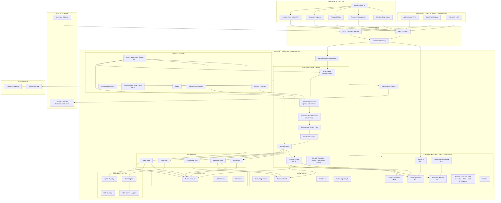
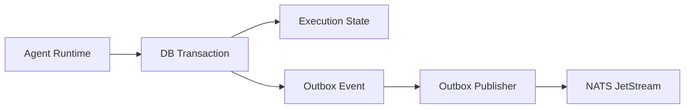

# Arquitectura de AI Agent Platform

## 1. Objetivo

AI Agent Platform es una **plataforma genérica orientada a intención** para resolver objetivos mediante IA sin acoplar a las aplicaciones consumidoras con agentes concretos, prompts, modelos, RAG, MCP, tools ni estrategias de orquestación. Los agentes son uno de los posibles mecanismos de ejecución de la plataforma, no la abstracción principal que ésta expone.

La frontera arquitectónica principal separa dos mundos:

- **Procesos y aplicaciones deterministas**: sistemas consumidores que solicitan una capacidad y trabajan con contratos estables.
- **Plataforma agéntica no determinista**: interpreta la intención, construye el contexto, decide la estrategia de ejecución y produce resultados.

Principio fundamental:

> Las aplicaciones expresan **QUÉ quieren conseguir**. La plataforma decide **CÓMO conseguirlo**.

Una nueva capacidad de negocio no debe implicar un nuevo contrato de integración.

---

## 2. Principios arquitectónicos

### 2.1 Contratos genéricos: evitando acoplamiento a procesos y aplicaciones

Como he comentado, la plataforma tiene la intencion de ser genérica y de que se puedan construir sobre ella las diferentes capas de negocio concreto. Por este motivo, no expone contratos específicos acoplados a un caso de negocio particular (ej:  `AnalyseProposalCommand`, `GenerateArchitectureCommand` o `ReviewCodeCommand`)

La entrada se normaliza como un `ExecutionCommand`. El caso de uso de negocio solicitado se representa como datos:

- `command.name`: etiqueta semántica machine-readable que describe el tipo de intención y puede utilizarse como hint, para observabilidad, políticas o métricas. No actúa como routing key hacia una implementación concreta.
- `intent`: objetivo expresado en lenguaje natural.
- `input`: datos estructurados sobre los que trabajar.
- `context`: contexto adicional conocido por el consumidor. Este dato es opcional
- `instructions`: aclaraciones o restricciones específicas de la ejecución. Este dato es opcional

Ejemplos de `command.name`:

- `analyse-proposal`
- `generate-architecture`
- `review-code`
- `prepare-presentation`

El nombre de comando describe semánticamente la intención, pero **no identifica ni una implementación, ni una capability registrada, ni un agente**. La plataforma no debe resolver el comando mediante mappings de negocio del tipo `analyse-proposal -> ProposalAnalysisCapability`.

### 2.2 Independencia del transporte

Como hemos visto en el punto anterior, el modelo de entrada es genérico, independientemente del canal de entrada. 
REST y NATS son adaptadores de transporte. Ambos deben mapear al mismo modelo canónico interno.

```text
REST Adapter ──┐
               ├──> ExecutionCommand ──> Command Gateway
NATS Adapter ──┘
```

No existirán dos caminos funcionales diferentes para REST y mensajería.

### 2.3 Commands in / Events out: manejando la latencia

En el caso de operaciones con agentes tenemos que tener muy en cuenta que son operaciones no deterministas y que la latencia puede variar bastante. Por este motivo, la entrada puede ser síncrona o asíncróna pero la respuesta siempre va a ser asíncróna:

- **Entrada de comandos**: REST o NATS JetStream.
- **Salida de ejecución**: siempre mediante eventos publicados en NATS JetStream.
- **Consultas**: REST para leer estado, ejecuciones y artifacts.

La aceptación de un comando no implica su finalización. Una llamada REST de escritura debe responder con `202 Accepted` y devolver los identificadores necesarios para seguir la ejecución.

### 2.4 Encapsulación de la inteligencia

Los consumidores de la plataforma no deberían conocer:

- agentes concretos;
- prompts;
- skills;
- herramientas;
- MCP servers;
- modelos;
- RAG;
- memoria;
- estrategia de planificación;
- número de pasos.

Una misma intención puede resolverse internamente con una tool directa, una skill, un agente, varios agentes, RAG, una combinación de estos recursos o incluso una operación determinista, sin cambiar el contrato externo. El consumidor enviará un comando (es decir, una intención, el QUÉ) y la plataforma se encarga del CÓMO. El usuario sí que dispone de campos en el mensaje de comando, como "context" e "instructions", en los que puede indicar ciertas recomendaciones o restricciones en la ejecución del CÓMO.

Principio adicional:

> **The platform is intent-driven, not workflow-driven and not agent-driven.**

Y, como consecuencia:

> **Agents are an execution mechanism, not the abstraction exposed by the platform.**

### 2.6 Trazabilidad extremo a extremo

Todos los mensajes deben incluir identificadores que permitan reconstruir la cadena causal:

- `messageId`
- `executionId`
- `correlationId`
- `causationId`

### 2.7 Durable delivery

Los comandos y eventos relevantes utilizarán **NATS JetStream**, no únicamente Core NATS, para disponer de persistencia, acknowledgements, redelivery y replay. Esto permite que si hay un fallo de la plataforma a nivel de infraestructura se pueda retomar el proceso en cuanto la plataforma vuelva a estar operativa.

---

## 3. Vista lógica de la plataforma



---

## 4. Componentes

### 4.1 REST Adapter

Expone la entrada síncrona para consumidores HTTP.

Responsabilidades:

- autenticación y autorización de transporte;
- validación sintáctica;
- deserialización;
- traducción al `ExecutionCommand` canónico;
- aceptación de la solicitud;
- devolución de `202 Accepted`.

No contiene lógica de orquestación ni lógica específica de casos de uso.

### 4.2 NATS Command Adapter

Consume comandos desde NATS JetStream y los traduce al mismo `ExecutionCommand` utilizado por REST.

Responsabilidades:

- durable consumer;
- ack/nack;
- deduplicación;
- validación del envelope;
- propagación de correlation y causation IDs;
- traducción al modelo interno.

### 4.3 Command Gateway

Punto de entrada único al dominio de ejecución.

Responsabilidades:

- validar semánticamente el comando;
- aplicar idempotencia;
- crear o localizar la `Execution`;
- entregar la intención normalizada al `Intent Resolver`;
- iniciar el procesamiento asíncrono.

El gateway no debe conocer detalles de agentes o proveedores LLM.

### 4.4 Intent Resolver

Interpreta semánticamente el `ExecutionCommand` y determina **qué debe conseguir la plataforma**.

Para resolver la intención utiliza conjuntamente:

- `command.name`, cuando exista, como hint semántico;
- `intent`;
- `input`;
- `context`;
- `instructions`.

No realiza routing mediante reglas de negocio predefinidas ni mappings del tipo:

```text
analyse-proposal -> ProposalAnalysisHandler
```

o:

```text
analyse-proposal -> ProposalAnalysisCapability
```

El `Intent Resolver` construye una representación normalizada de la intención y la entrega al planner. El contrato externo no determina la estrategia de ejecución.

Ejemplo conceptual:

```text
ExecutionCommand
      |
      v
Intent Resolver
      |
      v
Normalized Intent
      |
      v
Execution Planner
```

El `command.name` puede ser útil para trazabilidad, observabilidad, políticas, métricas o como pista semántica, pero nunca debe forzar la selección de un agente, workflow o capability concreta.

### 4.5 Agentic Runtime

Es el núcleo de ejecución.

Contiene:

- planificación;
- orquestación;
- ejecución de agentes;
- administración de pasos;
- gestión del contexto;
- durable execution;
- control de errores y reintentos.

### 4.6 Planner

Decide dinámicamente **cómo resolver la intención** a partir de los recursos disponibles en la plataforma.

Puede determinar que la ejecución requiera:

- una llamada directa a una tool;
- una skill;
- un agente;
- varias tools;
- una combinación de tool + agente;
- RAG + agente;
- múltiples agentes;
- un plan multi-step;
- una operación determinista si no es necesario utilizar un agente.

Puede generar un plan lineal, paralelo o dinámico. Para ello descubre los recursos disponibles a través de los registries de agentes, skills, tools, conocimiento y modelos.

No debe existir un workflow de negocio obligatorio asociado a `command.name`. Dos ejecuciones con una intención equivalente pueden utilizar estrategias diferentes si el contexto, los recursos disponibles o las políticas de la plataforma cambian.

### 4.7 Orchestrator

Coordina la ejecución del plan:

- orden de pasos;
- dependencias;
- ejecución paralela;
- invocación de agentes;
- invocación de skills y tools;
- manejo de resultados parciales;
- revisión o iteración cuando proceda.

### 4.8 Execution Engine

Ejecuta unidades concretas de trabajo y mantiene el modelo de estado de la `Execution`.

Debe soportar progresivamente:

- retries;
- timeouts;
- pause/resume;
- cancelación;
- human approval;
- recovery tras reinicio.

### 4.9 Context Engineering

Construye el contexto efectivo de cada llamada a un modelo a partir de:

- intención;
- input;
- instrucciones;
- contexto del consumidor;
- memoria;
- conocimiento recuperado;
- resultados de tools;
- políticas;
- skills;
- estado de la ejecución;
- presupuesto de tokens.

El consumidor proporciona intención e información; **no construye el prompt final**.

### 4.10 Agent Registry

Catálogo versionado de agentes.

Un agente define, como mínimo:

- identidad;
- rol;
- objetivo;
- instrucciones base;
- skills permitidas;
- tools permitidas;
- políticas;
- requisitos de modelo.

### 4.11 Skill Registry

Catálogo de capacidades reutilizables de razonamiento o procedimiento.

Una skill expresa **cómo realizar una tarea**, pero no necesariamente ejecuta una acción externa.

Ejemplos:

- diseño de APIs;
- revisión de arquitectura;
- análisis de requisitos;
- generación de ADR.

### 4.12 Tool Registry / Tool Runtime

Abstracción para capacidades ejecutables externas.

Un agente debe invocar una tool por capacidad lógica, sin depender del mecanismo técnico de integración.

Una tool puede implementarse mediante:

- código nativo;
- API REST;
- SDK;
- MCP.

### 4.13 MCP

MCP se considera un mecanismo de integración dentro de la Tool Layer, no una capacidad de negocio.

La plataforma es responsable de:

- descubrimiento;
- conexión con MCP servers;
- exposición de tools al runtime;
- validación;
- observabilidad;
- políticas de acceso.

Las aplicaciones consumidoras no interactúan directamente con MCP.

### 4.14 Knowledge Layer

Abstracción de conocimiento de la plataforma.

Incluye:

- fuentes documentales;
- ingestión;
- parsing;
- chunking;
- embeddings;
- índices;
- retrieval;
- búsqueda híbrida;
- reranking;
- RAG;
- metadatos;
- ontologías;
- knowledge graph.

RAG es una técnica dentro de esta capa, no la capa completa.

### 4.15 Ontologies / Semantic Layer

Define conceptos y relaciones del dominio para mejorar recuperación, normalización y razonamiento.

No es obligatoria para todas las capacidades y se incorporará de forma incremental.

### 4.16 Memory & State

Separa explícitamente:

- **Working Memory**: contexto temporal de una ejecución.
- **Session Memory**: información mantenida en una sesión lógica.
- **Persistent Memory**: conocimiento reutilizable entre ejecuciones.
- **Execution State**: estado durable del workflow.
- **Cache**: optimización técnica.

Cache no equivale a memoria.

### 4.17 Model Gateway

Evita que agentes y runtime dependan directamente de proveedores concretos.

Responsabilidades:

- abstracción de proveedores;
- routing;
- fallback;
- retries;
- timeouts;
- structured outputs;
- capacidades de modelos;
- token accounting;
- control de coste;
- rate limiting.

### 4.18 Observability, Governance & Evals

Capacidades transversales:

- distributed tracing;
- métricas;
- logs;
- auditoría;
- lineage;
- versionado;
- seguridad;
- autorización;
- guardrails;
- políticas;
- consumo de tokens;
- costes;
- evaluación de calidad.

Debe ser posible reconstruir por qué una ejecución tomó una decisión y qué información utilizó.

---

## 5. Modelo de ejecución

La entidad central es `Execution`.

Estados iniciales propuestos:

```text
ACCEPTED
   |
   v
PLANNING
   |
   v
RUNNING
   |
   +--> WAITING
   |       |
   |       v
   |     RUNNING
   |
   +--> COMPLETED
   |
   +--> FAILED
   |
   +--> CANCELLED
```

Una ejecución puede contener:

- steps;
- agent executions;
- tool calls;
- retrieved knowledge;
- artifacts;
- metrics;
- errors;
- emitted events.

---

## 6. Modelo de comunicación

### 6.1 Entrada

Los comandos pueden entrar por:

- REST;
- NATS JetStream.

Ambos producen el mismo `ExecutionCommand`.

### 6.2 Salida

La plataforma publica siempre resultados y lifecycle mediante NATS JetStream.

Familias conceptuales:

- `ExecutionLifecycleEvent`
- `ExecutionResultEvent`
- `ArtifactProducedEvent`

Los consumidores no reciben eventos específicos del caso de uso como contratos diferentes; el detalle de la capacidad va dentro del payload estándar.

### 6.3 Queries

REST se mantiene para lectura:

- `GET /executions/{id}`
- `GET /executions/{id}/events`
- `GET /executions/{id}/artifacts`
- `GET /artifacts/{id}`

Esto da un modelo próximo a CQRS:

```text
Commands -> REST / NATS
Events   -> NATS
Queries  -> REST
```

---

## 7. NATS JetStream

Se recomienda separar al menos conceptualmente comandos y eventos:

```text
PLATFORM_COMMANDS
  subjects:
    platform.commands.>

PLATFORM_EVENTS
  subjects:
    platform.events.>
```

La estrategia definitiva de subjects, streams, consumers y retention deberá documentarse antes de producción.

JetStream aporta:

- persistencia;
- at-least-once delivery;
- acknowledgements;
- redelivery;
- replay;
- consumers durables.

Por ser at-least-once, los consumidores y la propia plataforma deben ser idempotentes.

---

## 8. Transactional Outbox

### 8.1 Problema

Una transición de estado y la publicación de su evento no forman una transacción distribuida.

Ejemplo incorrecto:

```text
1. UPDATE execution SET status = 'COMPLETED'
2. publish execution.completed to NATS
```

Si la aplicación cae entre 1 y 2, la base de datos indica `COMPLETED`, pero el evento nunca se publica.

El orden inverso tiene el problema simétrico: el evento puede existir aunque el estado no se haya persistido.

### 8.2 Solución

Aplicar **Transactional Outbox**.

Dentro de la misma transacción local:

```text
BEGIN

UPDATE execution ...

INSERT INTO outbox_event ...

COMMIT
```

Después, un publisher independiente publica los registros pendientes en NATS JetStream.



### 8.3 Semántica

El patrón garantiza **eventual publication**, no exactly-once delivery extremo a extremo.

Pueden existir reintentos o duplicados, por lo que:

- cada evento tiene `messageId` único;
- los consumidores deben ser idempotentes;
- el publisher registra estado de publicación;
- la deduplicación no debe depender exclusivamente del broker.

### 8.4 Implementación inicial

Para la primera versión puede utilizarse:

- PostgreSQL para estado y tabla outbox;
- publisher periódico o reactivo;
- publicación a JetStream;
- marcación del evento como publicado.

Más adelante puede sustituirse el publisher por CDC si aporta valor, sin modificar los contratos externos.

---

## 9. Idempotencia

La entrada puede sufrir redelivery tanto por NATS como por reintentos HTTP.

La plataforma debe distinguir:

- `messageId`: identifica un mensaje concreto;
- `executionId`: identifica una ejecución;
- `correlationId`: agrupa una interacción o proceso;
- `causationId`: identifica el mensaje que causó el actual.

El gateway debe disponer de una política de idempotencia para impedir ejecuciones duplicadas cuando el mismo comando es reenviado.

---

## 10. Artifacts

Un resultado grande no debe viajar necesariamente embebido en NATS.

La plataforma utiliza el concepto de `Artifact` para resultados como:

- documentos Markdown;
- JSON extensos;
- código;
- imágenes;
- presentaciones;
- informes;
- archivos comprimidos.

El evento contiene metadata y referencia al artifact.

Esto evita:

- mensajes excesivamente grandes;
- duplicación;
- problemas de replay;
- acoplamiento al tamaño máximo del broker.

---

## 11. Control Plane y Runtime Plane

### Control Plane

Gestiona definiciones y configuración de los **recursos disponibles para resolver intenciones**:

- agents;
- skills;
- tools;
- MCP servers;
- knowledge bases;
- models;
- prompts;
- policies;
- versions.

### Runtime Plane

Gestiona ejecuciones:

- command processing;
- planning;
- orchestration;
- agents;
- tool calls;
- retrieval;
- memory;
- state;
- artifacts;
- events.

La UI administrativa trabaja principalmente sobre el Control Plane.

---

## 12. Decisiones a preservar

1. El contrato externo es genérico.
2. `command.name` es una etiqueta semántica/hint de la intención; no identifica una capability, workflow, handler o agente concreto.
3. REST y NATS convergen en el mismo modelo interno.
4. La salida funcional es siempre event-driven mediante NATS JetStream.
5. Las queries pueden realizarse mediante REST.
6. La ejecución es asíncrona y durable.
7. Los resultados grandes se modelan como artifacts.
8. Estado y eventos se mantienen consistentes mediante Transactional Outbox.
9. La plataforma, no el consumidor, administra prompts, agentes, RAG, MCP y modelos.
10. Añadir una nueva intención o caso de uso no implica añadir un nuevo contrato de integración ni un mapping de negocio dentro de la plataforma.
11. La plataforma es intent-driven: decide dinámicamente si resolver una intención mediante tools, skills, agentes, RAG, múltiples recursos o una operación determinista.
12. Los agents son mecanismos internos de ejecución, no la abstracción expuesta a los consumidores.

---

## 13. Architecture Decision Records (ADRs)

Esta sección registra decisiones tomadas durante la evolución de la plataforma, incluyendo el problema que las originó, la decisión, alternativas y consecuencias. Su objetivo es preservar el razonamiento arquitectónico y servir como material de referencia para futuras evoluciones y documentación técnica.

### ADR-001 — Tool es la abstracción; MCP es un mecanismo de integración

**Estado:** Accepted  
**Contexto:** M2 — Tools & MCP

#### Contexto

La plataforma necesita acceder a APIs, SDKs, servicios internos, Google Workspace y otros sistemas. Exponer MCP directamente al planner habría introducido conceptos técnicos como MCP server, JSON-RPC, stdio o tools/call dentro del modelo cognitivo.

#### Decisión

La abstracción estable del runtime es **Tool**. Una Tool representa una capacidad lógica ejecutable con nombre, descripción, instrucciones, input schema, políticas e implementación técnica. La implementación puede ser MCP, REST, SDK o código nativo.

```text
Planner / Agent
      |
      v
     Tool
      |
      +--> MCP adapter
      +--> REST adapter
      +--> SDK adapter
      +--> Native adapter
```

MCP queda encapsulado dentro de la Tool Layer y no forma parte del contrato externo de la plataforma.

#### Consecuencias

- El planner no depende de MCP.
- Sustituir MCP por REST no cambia el contrato lógico de la tool.
- Los consumidores externos no conocen el protocolo de integración.
- Las políticas y observabilidad pueden aplicarse sobre Tools de forma homogénea.

---

### ADR-002 — Provider response no equivale a Tool Result

**Estado:** Accepted  
**Contexto:** M2 — Google Workspace  
**Incidente:** resumen de un Google Docs.

#### Contexto

La primera integración usó docs_get_document y propagó el JSON completo de Google Docs API hasta el contexto del modelo. Ese JSON contiene índices, estilos, estructuras internas, metadatos y otros datos del proveedor que no aportan valor para un resumen.

En una ejecución real, este diseño produjo:

```text
222227 tokens > 200000 maximum
```

El problema no era LiteLLM. Tampoco era simplemente el tamaño del transporte MCP. El problema era haber confundido el contrato del proveedor con el contrato semántico que necesita el runtime.

#### Decisión

Las Tools deben exponer resultados **semánticos, compactos y orientados a la intención**.

Para Google Docs se mantienen dos capacidades:

```text
docs_get_document
    -> representación estructurada completa
    -> útil si se necesita estructura, layout o metadata

docs_get_text
    -> documentId + title + text + characterCount
    -> preferida para summarization / analysis / LLM reasoning
```

La plataforma registra `google-docs-get-text` y el router M2 v2 debe preferirla para resumen y análisis.

#### Regla general

> **Provider response != Tool contract.**

El adapter/tool decide qué información atraviesa la frontera hacia el runtime cognitivo.

#### Consecuencias

- menor consumo de tokens;
- menor latencia y coste;
- menor riesgo de superar la context window;
- menos ruido semántico;
- menor acoplamiento al proveedor;
- pueden coexistir varias Tools sobre una misma API, cada una con un contrato distinto.

#### Alternativas descartadas

- Aumentar la ventana de contexto: desplaza el problema y aumenta coste/latencia.
- Configurar sólo un context-window fallback en LiteLLM: útil como resiliencia, pero no corrige un contrato ineficiente.
- Enviar siempre el JSON completo: descartado por coste, ruido y falta de control.

---

### ADR-003 — Separar límite de transporte de presupuesto de contexto

**Estado:** Accepted  
**Contexto:** M2

#### Contexto

Durante la misma prueba aparecieron dos fallos distintos. Primero el cliente MCP stdio alcanzó el límite interno de lectura de asyncio y produjo:

```text
Separator is not found, and chunk exceed the limit
```

Después de permitir mensajes MCP mayores, el modelo rechazó el prompt por superar su context window.

#### Decisión

Se consideran explícitamente dos presupuestos independientes:

```text
Transport Budget != Model Context Budget
```

`MCP_MAX_MESSAGE_BYTES` responde a si la plataforma puede transportar correctamente el resultado.

`MAX_TOOL_RESULT_CHARS_FOR_MODEL` actúa como safety rail antes de inyectar un Tool Result en un prompt. No sustituye token accounting real; evita enviar resultados obviamente desproporcionados.

#### Consecuencias

Que un resultado pueda transportarse no significa que deba entrar completo en el contexto del modelo. Context Engineering deberá aplicar progresivamente selección, proyección, reducción, chunking, summarization intermedia, retrieval y token budgeting.

En M3, documentos grandes evolucionarán hacia parsing/chunking/RAG en lugar de transportarse siempre completos.

---

### ADR-004 — El adapter MCP normaliza el resultado protocolario

**Estado:** Accepted  
**Contexto:** M2

#### Contexto

MCP devuelve una envolvente protocolaria, por ejemplo `content`, `structuredContent` e `isError`. Propagar esa envolvente directamente obliga al runtime a conocer MCP y añade datos sin valor al contexto.

#### Decisión

El adapter MCP normaliza el resultado antes de entregarlo como Tool Result:

1. usar `structuredContent` cuando exista;
2. si hay un único bloque de texto con JSON válido, parsearlo;
3. si es texto plano, devolver texto;
4. conservar otros contenidos únicamente cuando sean necesarios.

```text
MCP envelope -> MCP Adapter -> normalized Tool Result -> Runtime
```

#### Consecuencias

- Business/runtime no conoce detalles del envelope MCP.
- Se reducen tokens de infraestructura.
- La metadata técnica queda separada del contenido semántico.
- Cambiar de protocolo no debería cambiar el contrato lógico de la Tool.

---

### ADR-005 — La BBDD prevalece sobre bootstrap Markdown

**Estado:** Accepted  
**Contexto:** M1/M2

Agents, Skills, Prompts, Tools y MCP Servers pueden declararse en Markdown, pero también modificarse desde API/UI.

#### Decisión

El bootstrap es **insert-if-missing**:

```text
Markdown existe + DB no existe -> INSERT
Markdown existe + DB existe    -> KEEP DATABASE VERSION
```

La base de datos es la source of truth en runtime.

#### Consecuencias

- Un restart no revierte cambios administrativos.
- Nuevos recursos bootstrap se incorporan sin alterar existentes.
- Evolucionar un recurso bootstrap existente requiere versionado/nuevo nombre o promoción explícita.
- Por ello el router actualizado se introduce como `intent-router-tools-v2` en vez de sobrescribir silenciosamente el prompt existente.

---

### ADR-006 — Separar modelo de routing y modelo de ejecución

**Estado:** Accepted  
**Contexto:** M1

Resolver una intención suele requerir menos capacidad que ejecutar la tarea final.

#### Decisión

El runtime usa perfiles lógicos `router-fast` y `reasoning-default`, resueltos por LiteLLM hacia modelos físicos. La lógica de negocio no conoce identificadores concretos de proveedor/modelo.

#### Consecuencias

- routing más rápido y económico;
- cambio de modelo/proveedor sin modificar business code;
- base para futuros perfiles de razonamiento, visión o embeddings.

---

### ADR-007 — Los errores deben ser diagnósticos y correlacionables

**Estado:** Accepted  
**Contexto:** M2

La primera versión persistía únicamente `reason: RuntimeError`, insuficiente para distinguir problemas de MCP, OAuth, Google API, validación, modelo, context window o persistencia.

#### Decisión

Los errores de ejecución incluyen `stage`, `exceptionType`, mensaje técnico acotado, `strategy`, `agent` y `tool`. Los logs conservan el stacktrace completo y OpenTelemetry registra la excepción asociada al `executionId`.

Etapas iniciales:

```text
BUILD_COMMAND
RESOLVE_INTENT
EXECUTE_TOOL
EXECUTE_MODEL
PERSIST_RESULT
```

#### Consecuencias

La API permite diagnóstico rápido sin exponer stacktraces completos; logs y traces preservan el detalle técnico.

---

### ADR-008 — Un documentId de Drive no implica Google Docs nativo

**Estado:** Accepted  
**Contexto:** M2; evolución prevista M3/M4

Una prueba inicial utilizó un Word almacenado en Drive con `docs_get_document`. Google respondió que la operación no estaba soportada para un Office file.

#### Decisión

No ocultar diferencias importantes de formato detrás de una llamada incorrecta a Google Docs API.

Para Google Docs nativo:

```text
docs_get_text
```

Para DOCX/PDF u otros binarios:

```text
Drive metadata -> download/export -> parser específico -> semantic document representation
```

La composición automática de varias Tools pertenece al Planner/Orchestrator multi-step de M4. La ingestión, parsing, chunking y retrieval documental a escala pertenece a M3 Knowledge/RAG.

---

## 14. Lecciones de M2 para Context Engineering

La prueba de resumen de Google Drive establece esta frontera:

```text
External Provider
      |
      v
Integration Protocol (MCP)
      |
      v
Tool Adapter
      |
      v
Semantic Tool Result
      |
      v
Context Engineering
      |
      v
Model Gateway
      |
      v
LLM
```

Responsabilidades:

- **Provider/API:** expone su modelo nativo.
- **MCP:** transporta capacidades y resultados.
- **Tool Adapter:** proyecta el modelo del proveedor a un contrato lógico.
- **Context Engineering:** decide qué parte merece entrar en contexto.
- **Model Gateway:** selecciona modelo y aplica routing, límites y coste.
- **LLM:** razona únicamente sobre el contexto finalmente preparado.

Reglas a preservar:

> **Que un dato pueda transportarse no significa que deba entrar completo en la ventana de contexto.**

> **Una integración técnicamente correcta puede ser arquitectónicamente incorrecta si propaga demasiado detalle hacia el modelo.**

Estas decisiones serán base explícita de M3 (Knowledge/RAG) y M4 (Agentic Orchestration).

---

## 15. M3 — Managed Knowledge / RAG

M3 convierte el conocimiento documental en un recurso gestionado de la plataforma. No se limita al caso de resumir documentos grandes: su objetivo principal es permitir que agentes y ejecuciones consulten documentación de referencia, políticas, arquitecturas, patrones, perfiles aprobados y reglas de validación.

### ADR-009 — Managed Knowledge es un recurso de primer nivel

**Estado:** Accepted  
**Contexto:** M3

#### Decisión

Se introduce `KnowledgeBase` como recurso administrado, independiente de agentes, tools y prompts. Una base de conocimiento puede contener múltiples documentos y ser utilizada por cualquier ejecución o asociada explícitamente a agentes.

Scopes soportados:

```text
EXECUTION
SESSION
USER
TENANT
GLOBAL
```

Políticas de retención:

```text
PERSISTENT
TTL
```

Esto permite utilizar el mismo pipeline tanto para conocimiento corporativo persistente como para conocimiento efímero de una ejecución.

#### Consecuencias

- RAG no implica persistencia permanente.
- La retención se decide independientemente de la técnica de retrieval.
- El conocimiento puede reutilizarse entre ejecuciones sin volver a parsear/embeber los documentos.
- Bases TTL se eliminan automáticamente junto con documentos y chunks.

---

### ADR-010 — Ingestar semánticamente, no convertir todo a PDF

**Estado:** Accepted

#### Contexto

Una opción era convertir cualquier formato entrante a PDF y utilizar un único parser. Esto simplifica el pipeline pero destruye estructura útil, especialmente en presentaciones y hojas de cálculo.

#### Decisión

Se utiliza parsing nativo siempre que sea razonable:

```text
PDF   -> PyMuPDF
DOCX  -> python-docx
PPTX  -> python-pptx
XLSX  -> openpyxl
CSV   -> parser CSV
TXT/MD/JSON -> parser nativo
```

Google Docs, Slides y Sheets utilizan proyecciones semánticas del MCP de Google Workspace.

LibreOffice se utiliza únicamente como fallback portable para formatos legacy/ODF:

```text
DOC / PPT / XLS / ODT / ODP / ODS
      -> LibreOffice headless
      -> PDF temporal
      -> extracción
```

LibreOffice forma parte de la imagen Docker de agent-platform; la ejecución no depende de software instalado en el host.

#### Consecuencias

- Se preservan páginas, slides, sheets y tablas como metadata de chunks.
- Se evita degradar hojas de cálculo a una representación visual antes del parsing.
- El fallback sigue siendo portable.

---

### ADR-011 — Retrieval híbrido semántico + lexical

**Estado:** Accepted

#### Decisión

Los chunks se almacenan en PostgreSQL con `pgvector` y full-text search.

Cada chunk contiene:

```text
content
metadata
embedding vector(768)
search_vector tsvector
```

La búsqueda combina similitud coseno y ranking lexical. Los embeddings se obtienen mediante una abstracción independiente `EmbeddingProvider`, desacoplada del Model Gateway.

Implementación portable por defecto:

```text
Knowledge Service
      -> EmbeddingProvider
      -> HashEmbeddingProvider
      -> vector(768)
```

#### Consecuencias

- El business code no depende de un proveedor/modelo concreto.
- El runtime local no necesita Ollama ni descargar modelos.
- El provider hash es válido para desarrollo/integración, no como garantía de calidad semántica productiva.
- Un provider cloud/real puede sustituirlo manteniendo el contrato `EmbeddingProvider`.
- La dimensión de embedding actual (768) forma parte del esquema de almacenamiento M3 y requerirá migración si cambia el provider por otro de dimensión diferente.

---

### ADR-012 — El ciclo de vida del documento es explícito y reindexable

**Estado:** Accepted

#### Decisión

Los documentos tienen estado de ingestión:

```text
PENDING -> INDEXING -> READY
                   -> FAILED
```

La creación de un documento sólo registra la fuente. Un worker de Knowledge procesa parsing, chunking, embeddings e indexado.

Actualizar un fichero subido incrementa su versión y reconstruye todos sus chunks. Para fuentes Google, `reindex` vuelve a leer la fuente actual por su ID. Eliminar un documento elimina por cascade sus chunks y elimina el binario local cuando exista.

#### Consecuencias

- El lifecycle es observable.
- Una actualización no mezcla chunks de versiones antiguas y nuevas.
- El origen (`sourceType + sourceId`) identifica fuentes Google dentro de una KB.
- M5 podrá hacer durable el proceso de ingestión sin cambiar el modelo externo.

---

### ADR-013 — Knowledge puede actuar como REFERENCE o GUARDRAIL

**Estado:** Accepted

#### Contexto

El conocimiento no siempre se utiliza del mismo modo. Una arquitectura de referencia orienta una solución; un catálogo de perfiles permitidos o una política de seguridad debe funcionar como restricción.

#### Decisión

Las asignaciones Agent -> KnowledgeBase incluyen `usageMode`:

```text
REFERENCE
GUARDRAIL
```

`REFERENCE` aporta grounding, ejemplos y contexto.

`GUARDRAIL` indica que los fragmentos recuperados contienen reglas/constraints contra los que debe contrastarse la solución o el input que se está validando.

El runtime M3 soporta:

```text
RAG_LLM
AGENT_RAG_LLM
AGENT_TOOL_RAG_LLM
```

Los resultados registran las bases utilizadas y metadata de los retrieval hits para trazabilidad.

#### Límite de M3

M3 permite generación grounded y validación explícita contra conocimiento. Una validación automática multi-step del tipo `generar -> recuperar reglas -> validar -> reparar` pertenece a M4 Agentic Orchestration.

---

### ADR-014 — Conocimiento efímero y conocimiento persistente comparten pipeline

**Estado:** Accepted

#### Decisión

No se implementan dos RAG distintos. Una KB persistente y una KB efímera usan el mismo pipeline:

```text
source
  -> parse
  -> chunk
  -> embed
  -> index
  -> retrieve
```

La diferencia está en scope y retention:

```text
Reference architecture KB:
  scope = TENANT
  retention = PERSISTENT

One-off huge document:
  scope = EXECUTION
  retention = TTL
```

Un cleanup worker elimina las KB TTL expiradas.

#### Evolución M4

El Planner + Feasibility Engine podrá crear automáticamente una KB efímera cuando detecte que un documento requerido para una ejecución excede el presupuesto de contexto directo.

---

### ADR-015 — El RAG pertenece a la plataforma, no al agente

**Estado:** Accepted

#### Decisión

Los agentes pueden declarar/asociar qué bases de conocimiento les resultan relevantes, pero no implementan por sí mismos vector stores, chunking, embeddings ni retrieval.

```text
Agent
   -> logical knowledge assignment
Platform Knowledge Layer
   -> ingestion
   -> indexing
   -> retrieval
   -> context construction
```

#### Consecuencias

- Distintos agentes reutilizan el mismo conocimiento.
- Las políticas de retención y seguridad se centralizan.
- Cambiar pgvector, embeddings o estrategia de retrieval no obliga a modificar agentes.
- El conocimiento recuperado es trazable como parte de la ejecución.

---

### M3: pipeline implementado

```text
                  +---------------------------+
Upload ---------->| Native Document Parsers   |
                  +---------------------------+
                               |
Google Docs/Slides/Sheets -> MCP semantic readers
                               |
                               v
                       ParsedDocument
                               |
                               v
                 per-KB chunking policy
                               |
                               v
                    EmbeddingProvider
                               |
                               v
                  PostgreSQL + pgvector + FTS
                               |
                               v
                       Hybrid Retrieval
                               |
                               v
                    Context Engineering
                               |
                               v
                        Agent / LLM
```

Formatos iniciales:

- PDF
- DOCX
- PPTX
- XLSX
- CSV
- TXT / Markdown / JSON
- Google Docs
- Google Slides
- Google Sheets
- DOC/PPT/XLS/ODT/ODP/ODS mediante fallback LibreOffice.

El almacenamiento binario local está montado como volumen Docker `/data/knowledge`, separado de PostgreSQL. Los chunks, embeddings, metadata y lifecycle permanecen en PostgreSQL.


---

### ADR-016 — Embeddings desacoplados del Model Gateway y sin dependencia obligatoria de Ollama

**Estado:** Accepted  
**Contexto:** M3 — revisión de portabilidad local

#### Contexto

La primera implementación de M3 resolvía embeddings mediante:

```text
Knowledge Service
  -> LiteLLM
  -> embedding-default
  -> Ollama
  -> nomic-embed-text-v2-moe
```

Aunque la abstracción lógica era correcta, el runtime local quedaba obligado a descargar y ejecutar una imagen pesada de Ollama. En entornos de desarrollo con Docker/Colima esto introduce consumo significativo de disco y memoria y puede impedir incluso arrancar la plataforma.

La rama `feat/agent-platform-integration` de `proposal-app` ya utilizaba una abstracción específica de embedding con un provider hash determinista y sin credenciales para desarrollo/integración.

#### Decisión

Embeddings dejan de formar parte de `ModelGatewayPort`.

Se introduce una abstracción independiente:

```text
EmbeddingProvider
  - provider_key
  - model
  - dimensions
  - embed(texts)
```

El runtime portable por defecto usa:

```text
HashEmbeddingProvider
model = hash-embedding-v1
dimensions = 768
```

No necesita:

- Ollama;
- GPU;
- CUDA;
- descarga de modelos;
- credenciales adicionales.

LiteLLM vuelve a dedicarse únicamente a modelos generativos.

#### Consecuencias

Positivas:

- el `docker-compose` local deja de incluir Ollama;
- M3 puede arrancar en máquinas con recursos limitados;
- embeddings y modelos generativos evolucionan independientemente;
- sustituir el provider hash por Bedrock, OpenAI, Vertex AI u otro proveedor requerirá un adapter de `EmbeddingProvider`, no cambios en ingestión/retrieval.

Trade-off:

- `HashEmbeddingProvider` es apropiado para desarrollo, integración y pruebas funcionales;
- no ofrece la calidad semántica de un embedding model de producción;
- antes de considerar M3 productivo deberá añadirse al menos un provider remoto/real y evaluarlo con datasets de retrieval.

---

### ADR-017 — La estrategia de chunking pertenece a cada Knowledge Base

**Estado:** Accepted  
**Contexto:** M3

#### Contexto

La primera versión aplicaba globalmente un split por caracteres con tamaño y overlap configurados por variables de entorno.

Esto no representa bien la diversidad documental:

- una normativa se beneficia de párrafos/secciones;
- Markdown puede aprovechar headings;
- PDFs deben conservar fronteras de página;
- documentos grandes pueden requerir parent/child chunks.

#### Decisión

Cada `KnowledgeBase` almacena su propia `chunkingPolicy`.

Formato inicial:

```json
{
  "strategy": "PARAGRAPH",
  "chunkSize": 1600,
  "overlap": 200,
  "parentSize": 6000,
  "childSize": 1600,
  "childOverlap": 200
}
```

Las unidades de M3 actuales son **caracteres**, no tokens. El token accounting real pertenece a Context Engineering y podrá sustituir esta aproximación sin cambiar el contrato conceptual.

Estrategias soportadas:

```text
FIXED
PARAGRAPH
HEADING
PAGE
HIERARCHICAL
```

`HIERARCHICAL` genera parent chunks no embebidos y child chunks embebidos:

```text
Parent (~6000 chars)
   |
   +-- Child (~1600)
   +-- Child (~1600)
   +-- Child (~1600)
```

Los chunks mantienen metadata estructural procedente del parser (page, slide, sheet, table, etc.) además de metadata propia del chunker.

#### Consecuencias

- dos KB pueden usar estrategias diferentes;
- cambiar la política no requiere modificar código;
- un reindex aplica la política actual de la KB;
- la metadata de ingestión registra la política efectiva;
- la estrategia podrá evolucionar a token-aware/semantic chunking manteniendo el mismo modelo de configuración.


---

## 16. M4 — Agentic Orchestration con LangGraph

M4 sustituye el modelo de selección de una única estrategia de M1-M3 por un plan lógico multi-step. Una ejecución simple puede seguir produciendo un plan de un solo paso; una intención compleja puede producir un grafo con pasos secuenciales o paralelos.

Flujo implementado:

```text
ExecutionCommand
      |
      v
Planner (LLM)
      |
      v
LogicalPlan tipado
      |
      v
Plan Validator / Feasibility
      |
      v
OrchestrationEngine Port
      |
      v
LangGraphOrchestrationEngine
      |
      v
Step Executor
      |
      +--> AGENT
      +--> TOOL
      +--> KNOWLEDGE
      +--> VALIDATE
      +--> MODEL
```

### LogicalPlan

El Planner devuelve exclusivamente un contrato estructurado:

```json
{
  "objective": "Diseñar y validar una arquitectura",
  "steps": [
    {
      "id": "design",
      "type": "AGENT",
      "description": "Diseñar la solución con las arquitecturas de referencia",
      "agent": "solution-architect",
      "knowledgeBases": ["architecture-reference"],
      "dependsOn": []
    },
    {
      "id": "validate",
      "type": "VALIDATE",
      "description": "Validar la solución contra perfiles aprobados",
      "knowledgeBases": ["approved-technology-profiles"],
      "knowledgeUsageMode": "GUARDRAIL",
      "dependsOn": ["design"]
    }
  ],
  "finalStepId": "validate"
}
```

El plan es dominio de la plataforma. No contiene nodos, channels, Pregel tasks ni otros conceptos internos de LangGraph.

### Tipos de step M4

```text
AGENT      -> agente registrado + skills + knowledge opcional + LLM
TOOL       -> Tool Layer M2 (MCP/otros adapters)
KNOWLEDGE  -> retrieval M3
VALIDATE   -> retrieval de constraints + validación mediante modelo
MODEL      -> razonamiento/síntesis genérico
```

Los argumentos de una Tool pueden referenciar datos del comando o outputs anteriores:

```text
${command.input.documentId}
${steps.search.output.files.0.id}
```

Esto permite composición multi-step sin introducir adaptaciones específicas por proceso.

### Validación determinista

El LLM **propone** el plan. No decide si el plan es estructuralmente válido.

Antes de compilar el grafo, el plan pasa por dos puntos deterministas:

```text
LLM Planner
    |
    v
LogicalPlan propuesto
    |
    v
PlanPolicyEnricher
    |
    v
LogicalPlan efectivo
    |
    v
PlanValidator
```

`PlanPolicyEnricher` aplica políticas que el LLM no puede relajar. En M5 incluye la política de aprobación humana asociada a cada Tool. Después, `PlanValidator` comprueba de forma determinista:

- número máximo de pasos;
- IDs únicos;
- dependencias existentes;
- ausencia de ciclos;
- existencia y estado enabled de agentes;
- existencia y estado enabled de Tools;
- existencia y estado enabled de Knowledge Bases;
- requisitos obligatorios por tipo de step;
- `finalStepId` válido;
- modos de conocimiento `REFERENCE/GUARDRAIL`.

La validación se persiste junto al plan.

### Ejecución LangGraph

`LangGraphOrchestrationEngine` implementa el puerto estable `OrchestrationEnginePort`.

```text
Domain LogicalPlan
      |
      v
OrchestrationEnginePort
      |
      v
LangGraphOrchestrationEngine
      |
      v
StateGraph
```

Los steps sin dependencias pueden ser programados por LangGraph en paralelo. Cuando un step tiene varias dependencias, el edge conjunto actúa como join antes de continuar.

La plataforma no expone LangGraph en sus contratos externos. En el futuro otra implementación podría usar un runtime cloud o un engine diferente sin cambiar `LogicalPlan`.

### Observabilidad de primera clase para la UI

M4 persiste dos nuevas entidades:

```text
execution_plans
execution_plan_steps
```

Por ejecución se conserva:

- objetivo del plan;
- JSON completo del LogicalPlan;
- resultado de validación;
- modelo utilizado por el Planner;
- tokens consumidos por el Planner;
- estado global del plan;
- timestamps de inicio/fin.

Por step se conserva:

- tipo;
- descripción de la actividad;
- agente activo;
- tool activa;
- Knowledge Bases;
- dependencias;
- estado `PENDING/RUNNING/COMPLETED/FAILED`;
- timestamps;
- output;
- error;
- consumo de tokens.

Esto permite construir una UI tipo grafo:

```text
                    ┌───────────────┐
                    │ design        │
                    │ AGENT         │
                    │ RUNNING       │
                    │ 2,431 tokens  │
                    └───────┬───────┘
                            |
                ┌───────────┴───────────┐
                v                       v
        ┌───────────────┐       ┌───────────────┐
        │ security      │       │ cost          │
        │ AGENT         │       │ AGENT         │
        └───────┬───────┘       └───────┬───────┘
                └───────────┬────────────┘
                            v
                    ┌───────────────┐
                    │ validate      │
                    │ VALIDATE      │
                    └───────────────┘
```

La API preparada para esa UI es:

```text
GET /v1/executions/{executionId}/orchestration
```

La respuesta incluye:

```text
plan
steps
activeAgents
usage.promptTokens
usage.completionTokens
usage.totalTokens
```

Además se publican en NATS:

```text
platform.events.execution.orchestration
```

con eventos:

```text
PLAN_CREATED
PLAN_STARTED
STEP_STARTED
STEP_COMPLETED
STEP_FAILED
PLAN_COMPLETED
PLAN_FAILED
```

Una UI futura podrá elegir polling REST, suscripción a un backend que consuma estos eventos, o una combinación de snapshot + eventos.

### ADR-018 — LangGraph es implementación del OrchestrationEngine, no dominio de la plataforma

**Estado:** Accepted  
**Contexto:** M4

#### Decisión

Se utiliza LangGraph como motor de ejecución de grafos, detrás de `OrchestrationEnginePort`.

```text
Platform Domain
    LogicalPlan
        |
        v
OrchestrationEnginePort
        |
        +--> LangGraphOrchestrationEngine
        +--> future cloud/runtime adapter
```

#### Consecuencias

- los contratos externos no dependen de LangGraph;
- Agents, Tools, Skills y Knowledge siguen siendo recursos de la plataforma;
- sustituir LangGraph no exige cambiar `ExecutionCommand`;
- evitamos reinventar scheduling de DAGs, joins y ejecución paralela;
- LangGraph no se convierte en el modelo de negocio.

### ADR-019 — El Planner LLM propone; el runtime determinista valida

**Estado:** Accepted  
**Contexto:** M4

#### Decisión

El Planner utiliza un perfil separado:

```text
planner-default
```

y devuelve un `LogicalPlan` tipado. El LLM no puede ejecutar directamente recursos ni saltarse el plan validator.

Principio:

> **LLM proposes the plan; deterministic platform code decides whether the plan is structurally valid and executable.**

El plan y su validación quedan almacenados antes de iniciar LangGraph.

### ADR-020 — El plan y cada step son observables antes de tener UI

**Estado:** Accepted  
**Contexto:** M4

#### Decisión

La observabilidad funcional de una ejecución no se limita a traces técnicos. Plan, steps, agentes activos, actividad y tokens son estado consultable de la plataforma.

Esto permite que la futura UI sea una representación del estado ya existente y no requiera reconstruir el workflow desde logs.

También facilita auditoría, debugging, cálculo de coste y futuras Evals por step.

### ADR-021 — M4 no sustituye M5 Durable Runs

**Estado:** Implemented by M5  
**Contexto:** frontera M4/M5

M4 introdujo planificación, LangGraph y estado observable. M5 añade semántica durable sobre ese runtime:

- recovery tras caída mediante leases;
- checkpoints lógicos por step;
- retries y backoff;
- timeout por intento;
- pause/resume;
- cancelación;
- human approval;
- reanudación sin volver a ejecutar steps ya completados.

```text
M4 = planning + graph orchestration + visible step state
M5 = durable/recoverable execution semantics
```

LangGraph sigue siendo el motor de grafo. La durabilidad es una capacidad de plataforma y no una dependencia conceptual de LangGraph.


---

## 17. M5 — Durable Execution / Durable Runs

M5 convierte las ejecuciones M4 en ejecuciones recuperables y controlables. El objetivo no es únicamente conservar logs del workflow, sino poder continuar una ejecución después de una caída de proceso y permitir acciones operativas explícitas.

### Flujo durable

```text
Execution
   |
   v
Worker claims lease
   |
   v
Load existing LogicalPlan?
   | yes
   +------> recover plan + persisted step checkpoints
   |
   | no
   v
Planner -> LogicalPlan
   |
   v
LangGraph
   |
   v
StepExecutor
   |
   +--> checkpoint COMPLETED
   +--> RETRYING
   +--> WAITING_APPROVAL
   +--> PAUSED
   +--> FAILED
```

Si el proceso cae:

```text
RUNNING execution
      |
      v
lease expires
      |
      v
another worker claims execution
      |
      v
stored LogicalPlan is loaded
      |
      v
LangGraph graph is reconstructed
      |
      v
COMPLETED steps return persisted output
      |
      v
first incomplete step resumes
```

No se vuelve a llamar al Planner para una ejecución ya planificada.

### Leases y recovery multi-worker

Cada worker dispone de un identificador efímero y reclama una ejecución mediante:

```text
lease_owner
lease_expires_at
last_heartbeat_at
```

Mientras ejecuta, renueva el lease periódicamente.

Una ejecución `RUNNING` o `RETRYING` cuyo lease expire puede ser reclamada por otro worker usando `FOR UPDATE SKIP LOCKED`.

Esto evita que dos workers activos procesen voluntariamente la misma ejecución y permite recuperación tras caída de pod/proceso.

Los parámetros iniciales son:

```text
EXECUTION_LEASE_SECONDS=30
EXECUTION_HEARTBEAT_SECONDS=10
EXECUTION_CONTROL_POLL_SECONDS=0.5
```

### Checkpoint durable por step

La fuente durable es PostgreSQL:

```text
execution_plans
execution_plan_steps
```

Un step `COMPLETED` contiene su output persistido. Durante recovery, `StepExecutor` devuelve ese output sin repetir la operación.

Por tanto, el checkpoint lógico es:

```text
(step status + output + usage + attempts + approval state)
```

y no un objeto interno de LangGraph.

### Retry y backoff

Cada `PlanStep` admite:

```json
{
  "timeoutSeconds": 120,
  "retryPolicy": {
    "maxAttempts": 3,
    "initialBackoffSeconds": 1,
    "maxBackoffSeconds": 30,
    "multiplier": 2
  }
}
```

Estados relevantes:

```text
RUNNING
   |
 transient error
   v
RETRYING
   |
 backoff
   v
RUNNING
```

Se persisten:

- `attempt_count`;
- `last_attempt_at`;
- `next_retry_at`;
- error del intento;
- máximo de intentos.

Errores de configuración/semánticos como `ValueError` o recursos inexistentes como `LookupError` no se consideran transitorios por defecto.

### Timeout

Cada intento se ejecuta con un timeout wall-clock.

Cuando se supera:

```text
active model/tool operation
      |
      v
timeout
      |
      v
cancel asyncio task
      |
      v
retry policy
```

El timeout es por intento, no por ejecución completa.

### Pause / Resume

API:

```text
POST /v1/executions/{id}/pause
POST /v1/executions/{id}/resume
POST /v1/executions/{id}/retry   # only FAILED executions
```

Estados:

```text
RUNNING
   |
 pause requested
   v
PAUSING
   |
 runtime observes control
   v
PAUSED
   |
 resume
   v
ACCEPTED
   |
 worker claims
   v
RUNNING
```

El control se comprueba también mientras una llamada de modelo/tool está activa. La task async se cancela cooperativamente y la ejecución queda suspendida.

Los steps ya completados no vuelven a ejecutarse al reanudar.

### Cancellation

API:

```text
POST /v1/executions/{id}/cancel
```

Flujo:

```text
RUNNING
   |
 cancel requested
   v
CANCELLING
   |
 runtime observes control
   v
CANCELLED
```

Los steps incompletos pasan a `CANCELLED`; los ya `COMPLETED` conservan su output para auditoría.

### Human approval

La aprobación humana no depende exclusivamente de que el Planner produzca `requiresApproval=true`.

Cada Tool declara metadata de riesgo operacional:

```text
sideEffect:
  NONE
  READ
  WRITE
  EXTERNAL_ACTION

approvalPolicy:
  NEVER
  OPTIONAL
  REQUIRED
```

El flujo efectivo es:

```text
Planner proposes LogicalPlan
        |
        v
PlanPolicyEnricher
        |
        +-- Tool approvalPolicy=REQUIRED
        |       -> force requiresApproval=true
        |
        +-- Tool approvalPolicy=NEVER
        |       -> force requiresApproval=false
        |
        +-- Tool approvalPolicy=OPTIONAL
                -> preserve Planner proposal
        |
        v
PlanValidator
        |
        v
persist effective plan
        |
        v
LangGraph
        |
        v
StepExecutor rechecks current Tool policy
        |
        v
WAITING_APPROVAL before side effect
```

Por tanto existen **dos barreras deterministas**: una al construir el plan efectivo y otra inmediatamente antes de ejecutar la Tool. La segunda evita que un plan ya persistido omita una política `REQUIRED` que haya cambiado después de la planificación.

El Planner puede además marcar un step:

```json
{
  "requiresApproval": true,
  "approvalReason": "This step publishes the final artifact externally."
}
```

Antes de ejecutarlo:

```text
PENDING
   |
   v
WAITING_APPROVAL
```

La ejecución completa también queda en `WAITING_APPROVAL`.

Decisión:

```text
POST /v1/executions/{executionId}/steps/{stepId}/approval
```

Body:

```json
{
  "approved": true,
  "actor": "user@example",
  "comment": "Approved for publication"
}
```

Si se aprueba, la ejecución vuelve a `ACCEPTED` y se reanuda desde checkpoints. Si se rechaza, la ejecución finaliza como `CANCELLED`.

La plataforma conserva:

- actor;
- decisión;
- comentario;
- timestamp;
- razón del approval gate.

### Estados M5

Estados de ejecución relevantes:

```text
ACCEPTED
RUNNING
RETRYING
PAUSING
PAUSED
WAITING_APPROVAL
CANCELLING
CANCELLED
COMPLETED
FAILED
```

Estados de step:

```text
PENDING
RUNNING
RETRYING
PAUSED
WAITING_APPROVAL
CANCELLED
COMPLETED
FAILED
```

### Observabilidad para la futura UI

`GET /v1/executions/{executionId}/orchestration` incorpora ahora:

```text
activeAgents
waitingApprovals
retryingSteps
attemptCount
maxAttempts
nextRetryAt
timeoutSeconds
approval
idempotencyKey
usage
```

Esto permite representar visualmente:

```text
[design] COMPLETED
       |
       v
[deploy] WAITING_APPROVAL
         "Requires publication approval"

Approver: -
Attempts: 0/2
Tokens: 0
```

o:

```text
[analyse] RETRYING
Attempt 2 / 3
Next retry: 12:31:08
Last error: HTTP 503
```

Los cambios de estado siguen publicándose mediante lifecycle/orchestration events:

```text
EXECUTION_RECOVERED
EXECUTION_PAUSE_REQUESTED
EXECUTION_PAUSED
EXECUTION_RESUMED
EXECUTION_CANCEL_REQUESTED
EXECUTION_CANCELLED

STEP_RETRYING
STEP_WAITING_APPROVAL
STEP_APPROVED
STEP_REJECTED
```

### ADR-022 — La durabilidad pertenece a la plataforma, no a LangGraph

**Estado:** Accepted  
**Contexto:** M5

#### Decisión

No se utiliza el checkpoint interno de LangGraph como source of truth funcional.

La plataforma persiste su propio estado durable:

```text
Execution
LogicalPlan
PlanStep status
PlanStep output
Retry state
Approval state
Usage
```

Tras recovery se reconstruye el `StateGraph` y los steps completados se resuelven desde checkpoint.

#### Motivos

- el dominio no queda acoplado al formato de checkpoint de LangGraph;
- una futura implementación de `OrchestrationEnginePort` puede usar otro runtime;
- el estado durable es directamente consultable por APIs/UI;
- el plan y los steps siguen siendo la unidad de auditoría de la plataforma.

LangGraph continúa aportando ejecución del DAG, branching, joins y paralelismo.

### ADR-023 — Recovery mediante leases, no mediante ownership permanente

**Estado:** Accepted  
**Contexto:** M5

#### Decisión

Los workers usan leases renovables almacenados en PostgreSQL.

```text
claim -> lease -> heartbeat -> complete/release
                    |
                    X process crash
                    |
                    v
               lease expires
                    |
                    v
              another worker
```

La estrategia es compatible con múltiples réplicas Kubernetes del execution worker.

### ADR-024 — La semántica de retry es at-least-once

**Estado:** Accepted  
**Contexto:** M5

#### Decisión

La plataforma garantiza que un step `COMPLETED` no se repite durante recovery. Sin embargo, si un proceso cae después de producir un side effect externo pero antes de persistir `COMPLETED`, el step puede ejecutarse de nuevo.

Cada step dispone de un `idempotencyKey` estable:

```text
{executionId}:{stepId}
```

La clave se expone y persiste para que adapters/tools con side effects puedan adoptar idempotencia.

#### Límite

M5 no puede garantizar exactamente-once sobre un sistema externo que no soporte una operación idempotente/transaccional.

Por tanto:

> **Durable execution is at-least-once; side-effecting tools must be idempotent or support an idempotency key.**

### ADR-025 — Pause/cancel son controles cooperativos

**Estado:** Accepted  
**Contexto:** M5

La plataforma comprueba controles entre steps y durante operaciones async activas.

Cuando es posible cancela la task activa. Un proveedor externo puede haber procesado ya una operación aunque el cliente local sea cancelado; esto se relaciona con la semántica at-least-once del ADR-024.

### ADR-026 — Human approval es estado durable de plataforma

**Estado:** Accepted  
**Contexto:** M5

Los approval gates no se modelan únicamente como un interrupt efímero de LangGraph.

```text
requiresApproval
approvalStatus
approvalActor
approvalComment
approvalUpdatedAt
```

forman parte del estado persistente del step y son visibles por API/eventos.

Esto permite una futura UI, auditoría y reemplazo del motor de orquestación sin perder la semántica funcional del approval.


### ADR-027 — Human approval para Tools se impone mediante política determinista

**Estado:** Accepted  
**Contexto:** M5 hardening

#### Contexto

La primera versión de M5 permitía que el Planner estableciera `requiresApproval=true`. Esto no es suficiente para operaciones sensibles porque un LLM puede omitir el flag, generar un plan distinto o interpretar de forma diferente una instrucción de usuario.

#### Decisión

Las Tools son recursos declarativos con metadata de efecto y política:

```text
Tool
  sideEffect = NONE | READ | WRITE | EXTERNAL_ACTION
  approvalPolicy = NEVER | OPTIONAL | REQUIRED
```

El LLM sigue pudiendo proponer approval gates, pero **la política de plataforma es autoritativa**.

```text
LLM proposal
    |
    v
PlanPolicyEnricher        <-- deterministic enforcement point #1
    |
    v
PlanValidator
    |
    v
Persisted effective plan
    |
    v
StepExecutor
    |
    v
Current Tool policy check <-- deterministic enforcement point #2
    |
    +--> REQUIRED and not approved -> WAITING_APPROVAL
    |
    +--> approved/not required -> execute Tool
```

Para `REQUIRED`, `PlanPolicyEnricher` fuerza:

```text
requiresApproval = true
approvalSource = TOOL_POLICY
toolSideEffect = <snapshot>
toolApprovalPolicy = REQUIRED
```

La policy y su procedencia se persisten en `execution_plan_steps` y se exponen en la API de orquestación.

El `StepExecutor` vuelve a consultar la Tool antes de ejecutarla. Si la Tool ha cambiado a `REQUIRED` después de persistir el plan, el runtime eleva dinámicamente el step a approval obligatorio, persiste el cambio y emite `STEP_APPROVAL_POLICY_ENFORCED`.

#### Consecuencias

- un Planner no puede saltarse una política `REQUIRED`;
- la UI puede explicar **por qué** una ejecución está esperando aprobación;
- cambios de política entre planificación y ejecución se aplican de forma segura;
- el approval gate sigue siendo durable y auditable;
- la política pertenece al Tool Registry / Platform Policy, no al prompt.

Para las Tools bootstrap de Google que actualmente son sólo de lectura:

```text
sideEffect = READ
approvalPolicy = NEVER
```

Una futura Tool de escritura/publicación debería declarar explícitamente, por ejemplo:

```yaml
sideEffect: EXTERNAL_ACTION
approvalPolicy: REQUIRED
```

si la organización exige aprobación humana antes del side effect.


---

## 18. M6 — Control Plane / Angular Admin UI

M6 separa explícitamente la **administración y operación de la plataforma** del runtime de ejecución.

La plataforma dispone ahora de dos planos conceptuales:

```text
CONTROL PLANE
  Angular Admin UI
  Admin/Query APIs
  Resource management
  Execution explorer
  Approval inbox
  Diagnostics

RUNTIME PLANE
  Planner
  PlanPolicyEnricher
  PlanValidator
  LangGraph
  StepExecutor
  Agents / Tools / Knowledge
  Durable Execution
```

### UI Angular

El Control Plane se implementa en:

```text
control-plane-ui/
```

con Angular 20 y una aplicación standalone. El estilo visual toma como referencia la aplicación `proposal-app` de la rama `feat/agent-platform-integration`: sidebar oscura, paneles de alto contraste, cards, tablas operativas, badges de estado y modales de edición.

Se despliega como un contenedor Nginx independiente:

```text
control-plane-ui:8081
        |
        +-- static Angular assets
        |
        +-- /api/* -> agent-platform:8080/*
```

La UI no se conecta directamente a PostgreSQL, NATS, MCP o LiteLLM.

### Capacidades M6

El Control Plane incluye:

```text
Dashboard
Executions
Approvals
Agents
Skills
Prompts
Tools
MCP Servers
Knowledge Bases
Documents / upload / reindex
RAG retrieval playground
Agent -> Knowledge assignments
Runtime configuration
Diagnostics / observability links
```

#### Execution Explorer

La UI consume el estado funcional persistido de M4/M5 y representa:

- estado global de la ejecución;
- objetivo del plan;
- grafo lógico por niveles de dependencia;
- step type;
- agente o Tool responsable;
- estado de cada step;
- tokens;
- intentos y retry;
- approval gates;
- policy source;
- errores;
- lease owner;
- controles `pause/resume/retry/cancel`.

No reconstruye el workflow a partir de logs.

#### Approval Inbox

La Approval Inbox consulta steps en `WAITING_APPROVAL` y muestra de forma explícita:

```text
execution
step
agent/tool
reason
approvalSource
sideEffect
approvalPolicy
```

Las decisiones llaman al contrato durable M5:

```text
POST /v1/executions/{executionId}/steps/{stepId}/approval
```

La UI es únicamente un operador del estado durable; la semántica de aprobación sigue perteneciendo al runtime.

#### Resource Management

Desde el Control Plane se administran mediante las APIs ya existentes:

```text
Agents
Skills
Prompts
Tools
MCP Servers
Knowledge Bases
Knowledge Documents
Agent Knowledge assignments
```

La edición de Tools expone especialmente:

```text
sideEffect
approvalPolicy
```

para hacer visible la política determinista introducida en M5.

### Admin query API

M6 incorpora endpoints orientados a lectura agregada del Control Plane:

```text
GET /v1/admin/overview
GET /v1/admin/executions
GET /v1/admin/approvals
GET /v1/admin/runtime
```

No sustituyen a los contratos de runtime. Son read models/queries optimizadas para operación humana.

`/v1/admin/overview` expone contadores de recursos, ejecuciones, approvals, retries y outbox pendiente.

`/v1/admin/executions` devuelve la lista reciente de ejecuciones con estado de plan, approvals y retries.

`/v1/admin/approvals` representa la bandeja global de decisiones pendientes.

`/v1/admin/runtime` muestra perfiles de modelo activos, configuración de durabilidad, embeddings y salud básica de PostgreSQL/NATS.

### Observabilidad externa

El Control Plane enlaza, pero no reemplaza, las herramientas especializadas:

```text
Grafana
Prometheus
Jaeger
NATS Monitor
```

El principio es:

> **Control Plane muestra estado funcional y operativo de plataforma; las herramientas de observabilidad siguen siendo la fuente especializada de métricas y trazas.**

### ADR-028 — Control Plane y Runtime Plane son responsabilidades separadas

**Estado:** Accepted  
**Contexto:** M6

La UI y las APIs administrativas no forman parte del camino crítico de ejecución.

```text
Control Plane unavailable
        |
        X
        |
Runtime continues processing commands/events
```

Consecuencias:

- una caída del Angular/Nginx no detiene ejecuciones;
- el runtime no depende de sesiones de UI;
- la UI opera exclusivamente mediante contratos de plataforma;
- Kubernetes puede escalar/desplegar ambos planos independientemente.

### ADR-029 — La UI representa estado persistido, no infiere estado desde logs

**Estado:** Accepted  
**Contexto:** M6

Plan, steps, approvals, retries, tokens y leases se consultan desde el estado funcional ya persistido.

Esto evita que el frontend tenga lógica para interpretar trazas o recomponer workflows y mantiene una única fuente de verdad.

### ADR-030 — Admin APIs son read models del Control Plane

**Estado:** Accepted  
**Contexto:** M6

Se permiten endpoints `/v1/admin/*` específicos para operación porque son consultas del Control Plane, no nuevos comandos de negocio.

No contradicen el contrato genérico de integración de aplicaciones:

```text
Applications -> ExecutionCommand
Operators    -> Control Plane Admin Queries/Controls
```

Ambos actores tienen necesidades distintas y se mantienen explícitamente separados.

### ADR-031 — Angular/Nginx es un deployment independiente

**Estado:** Accepted  
**Contexto:** M6

La UI Angular se compila a assets estáticos y se sirve con Nginx. Nginx proxyfica `/api/` hacia `agent-platform`.

Esto proporciona:

- same-origin para el navegador;
- ausencia de dependencia CORS en local;
- imagen de UI independiente;
- sustitución futura del frontend sin afectar al runtime.

El puerto local por defecto es:

```text
http://localhost:8081
```


---

## 19. M7 — Context & Memory

M7 introduce una separación explícita entre **estado de ejecución**, **contexto de trabajo**, **sesión**, **memoria persistente** y **knowledge**.

En esta rama se completa M7 en cuatro bloques:

```text
M7.1  Sessions + Working Context       ✅
M7.2  Persistent Memory + Policies     ✅
M7.3  Context Engine + Budget Manager  ✅
M7.4  Context snapshots + UI           ✅
```

La decisión más importante fue separar persistencia de selección. M7.1 y M7.2 crean el modelo, persistencia, lifecycle, contratos y políticas; M7.3 añade después la selección efectiva, retrieval y budgeting antes de las llamadas de modelo del runtime.

### M7.1 — Sessions

Una `Session` agrupa ejecuciones relacionadas y proporciona una frontera de continuidad:

```text
Session
  |
  +-- Execution A
  |     +-- Working Context
  |
  +-- Execution B
  |     +-- Working Context
  |
  +-- Execution C
        +-- Working Context
```

El contrato público de ejecución incorpora un identificador opcional:

```json
{
  "sessionId": "0ecb...",
  "command": {
    "name": "refine-architecture",
    "intent": "Sustituye Kafka por NATS en la solución anterior."
  }
}
```

El mismo campo existe tanto en REST como en el envelope NATS.

Si no se envía `sessionId`, la ejecución sigue siendo completamente independiente, manteniendo compatibilidad con M0-M6.

Una sesión tiene:

```text
id
name
status = ACTIVE | CLOSED
scope = USER | TEAM | TENANT
ownerKey
metadata
expiresAt
createdAt
updatedAt
closedAt
```

Una sesión `CLOSED` o expirada no admite nuevas ejecuciones.

Las ejecuciones ya iniciadas antes del cierre pueden terminar normalmente.

APIs:

```text
POST /v1/sessions
GET  /v1/sessions
GET  /v1/sessions/{sessionId}
PUT  /v1/sessions/{sessionId}
POST /v1/sessions/{sessionId}/close

GET  /v1/sessions/{sessionId}/executions
GET  /v1/sessions/{sessionId}/context
```

### Working Context

El Working Context registra qué información ha producido realmente una ejecución.

No es memoria a largo plazo y no es el checkpoint durable de M5.

```text
Execution State
  = dónde está el workflow

Working Context
  = información producida/recibida durante la ejecución

Persistent Memory
  = información retenida para reutilización futura
```

Se persiste en:

```text
execution_context_entries
```

Cada entrada contiene:

```text
execution_id
session_id
step_id
entry_type
entry_key
content
priority
token_estimate
source_type
source_ref
provenance
created_at
```

Tipos iniciales:

```text
COMMAND
INSTRUCTION
PLAN
STEP_RESULT
TOOL_RESULT
KNOWLEDGE
FACT
ARTIFACT
SUMMARY
```

La persistencia de Working Context es **transaccional respecto al estado funcional que la genera**:

```text
create execution
    |
    +-- persist Execution
    +-- persist COMMAND context
    +-- persist INSTRUCTION context
    +-- outbox EXECUTION_ACCEPTED

save plan
    |
    +-- persist LogicalPlan
    +-- persist PLAN context
    +-- outbox PLAN_CREATED

complete step
    |
    +-- checkpoint step COMPLETED
    +-- persist STEP_RESULT / TOOL_RESULT / KNOWLEDGE
    +-- outbox STEP_COMPLETED

complete execution
    |
    +-- Execution COMPLETED
    +-- persist SUMMARY
    +-- result/lifecycle outbox
```

Esto evita una segunda operación best-effort que pudiera dejar un step completado pero sin su contexto asociado.

Cada entrada almacena además una estimación inicial de tokens. En M7.3 esa métrica será utilizada por el Context Budget Manager.

API:

```text
GET /v1/executions/{executionId}/context
```

### M7.2 — Persistent Memory

Persistent Memory es una entidad distinta de Knowledge/RAG.

```text
Knowledge
  "¿Qué sabe la organización o dominio?"

Memory
  "¿Qué se ha decidido, aprendido o retenido en interacciones previas?"

Working Context
  "¿Qué información existe en esta ejecución concreta?"
```

La persistencia utiliza:

```text
memory_entries
```

Scopes soportados:

```text
SESSION
USER
TEAM
TENANT
AGENT
```

Tipos:

```text
FACT
PREFERENCE
DECISION
CONSTRAINT
SUMMARY
LEARNED_CONTEXT
```

Estados:

```text
ACTIVE
SUPERSEDED
REVOKED
EXPIRED
```

Una memoria contiene:

```text
scopeType / scopeId
memoryType
key
content
metadata
confidence
importance
explicit
sourceExecutionId / sourceStepId
policyDecision
expiresAt
supersedesMemoryId
```

### Memoria explícita e inferida

Existen dos vías:

```text
Explicit memory
  -> POST /v1/memories
  -> confidence = 1.0
  -> Memory Policy
  -> persist / reject

Inferred candidate
  -> POST /v1/memory-candidates/evaluate
  -> confidence supplied by producer
  -> Memory Policy
  -> persist / reject
```

M7.2 incorpora además un **Memory Candidate Extractor** asistido por LLM para ejecuciones asociadas a una `Session`.

El extractor se ejecuta únicamente después de completar con éxito la ejecución:

```text
Execution COMPLETED
      |
      v
MemoryCandidateExtractor
      |
      v
SESSION-scoped candidates
      |
      v
MemoryPolicyEngine
      |
   +--+--------+
   |           |
 REJECT      PERSIST
```

El extractor sólo puede proponer candidatos con scope `SESSION`; no puede promover por sí mismo información a `USER`, `TEAM`, `TENANT` o `AGENT`. Esas memorias cross-session requieren una escritura explícita por API hasta que exista una capa de identidad/governance que permita decidir ese scope con garantías.

La extracción es **best-effort**: si el modelo extractor falla, la ejecución ya completada permanece `COMPLETED`. El fallo no degrada el resultado funcional.

El input del extractor está acotado por `MEMORY_EXTRACTOR_MAX_INPUT_CHARS` y utiliza el intent, input/context, instructions y un resumen compacto del resultado; no vuelca de nuevo outputs arbitrariamente grandes en otro prompt.

La decisión de persistencia sigue siendo siempre determinista y autoritativa en `MemoryPolicyEngine`.

### Memory Policy Engine

Toda escritura de Persistent Memory, incluida una memoria explícita, pasa por una política determinista:

```text
MemoryCandidate
      |
      v
MemoryPolicyEngine
      |
   +--+---------+
   |            |
 REJECT       PERSIST
                 |
                 v
          memory_entries
```

La configuración inicial incluye:

```text
MEMORY_ALLOW_INFERRED_PERSISTENCE=true
MEMORY_MIN_INFERRED_CONFIDENCE=0.80
MEMORY_MAX_CONTENT_CHARS=8000
MEMORY_AUTO_EXTRACT_SESSION=true
MEMORY_EXTRACTOR_MODEL_PROFILE=router-fast
MEMORY_EXTRACTOR_MAX_CANDIDATES=8
MEMORY_EXTRACTOR_MAX_INPUT_CHARS=50000
```

Reglas implementadas:

- scopes y tipos permitidos;
- contenido no vacío;
- tamaño máximo;
- confidence e importance entre 0 y 1;
- candidatos inferidos por debajo del threshold son rechazados;
- opcionalmente puede deshabilitarse toda persistencia inferida;
- contenido con apariencia de secretos se rechaza determinísticamente;
- la detección se aplica tanto al contenido como a metadata;
- una memoria `SESSION` sólo puede escribirse sobre una sesión existente y `ACTIVE`.

La protección de secretos incluye inicialmente detección de patrones para private keys, bearer tokens, passwords, API/access keys, AWS access keys y JWTs.

Esto es una **safety rail de persistencia**, no un sistema DLP completo. Governance más avanzada permanece en M8.

### Policy Audit

Cada evaluación queda registrada en:

```text
memory_policy_audit
```

incluyendo decisiones aceptadas y rechazadas.

Para evitar que el propio audit se convierta en una fuga de secretos, **el contenido del candidato no se almacena en el audit**. Se conserva:

```text
contentLength
contentSha256
metadataKeys
scope/type/key
confidence
importance
decision
```

API:

```text
GET /v1/memory-policy
GET /v1/memory-policy/audit
```

### Conflictos y supersession

Si existe una memoria activa con:

```text
same scopeType
same scopeId
same key
```

una nueva memoria aceptada no crea dos verdades activas.

```text
old memory
ACTIVE
   |
   | new accepted memory with same key
   v
SUPERSEDED
      \
       -> new memory ACTIVE
          supersedesMemoryId = old.id
```

Las memorias sin `key` pueden coexistir.

### TTL, revoke y lifecycle

Las memorias pueden tener `expiresAt`.

Un cleanup worker convierte:

```text
ACTIVE -> EXPIRED
```

cuando se supera el TTL.

Las memorias pueden invalidarse explícitamente:

```text
POST /v1/memories/{memoryId}/revoke
```

que produce:

```text
ACTIVE -> REVOKED
```

Al cerrar o expirar una Session, las memorias con:

```text
scopeType=SESSION
scopeId=<sessionId>
```

pasan automáticamente a `EXPIRED`.

### APIs de memoria

```text
GET  /v1/memories
GET  /v1/memories/{memoryId}
POST /v1/memories
POST /v1/memories/{memoryId}/revoke

POST /v1/memory-candidates/evaluate

GET  /v1/memory-policy
GET  /v1/memory-policy/audit
```

La consulta soporta filtros por:

```text
scopeType
scopeId
memoryType
status
q
limit
```

M7.3 incorpora retrieval híbrido de memoria mediante pgvector + full-text search + importance. Con el provider local `hash`, la componente vectorial es lexical-feature hashing; un embedding provider semántico de producción podrá sustituirlo sin cambiar el contrato. Las memorias se embeben al persistirse y la selección se limita a scopes explícitamente asociados a la Session.

### Command metadata

M7 corrige además una pérdida de información previa: `Command.metadata` formaba parte del contrato público pero no quedaba persistido en `executions`.

Ahora se conserva como:

```text
executions.command_metadata
```

y se restaura al reconstruir el `Command` en el worker durable.

### M7.3 — Context Engine + Budget Manager

Los steps que llaman a un modelo ya no concatenan directamente command, outputs previos y RAG. `StepExecutor` delega en `ContextEngine`:

```text
Command
+ Current Step
+ Previous Results
+ Session Working Context
+ Relevant Persistent Memory
+ Managed Knowledge
+ System Prompt
        |
        v
Context Engine
        |
        v
Budget Manager
        |
   +----+----------------+
   |                     |
 include              compress/drop
   |                     |
   +----------+----------+
              |
              v
       EffectiveContext
              |
              v
          Model Gateway
```

El budget inicial es configurable:

```text
CONTEXT_MODEL_WINDOW_TOKENS=200000
CONTEXT_RESERVED_OUTPUT_TOKENS=16000
CONTEXT_SAFETY_MARGIN_TOKENS=10000
CONTEXT_SESSION_MAX_ENTRIES=24
CONTEXT_MEMORY_TOP_K=8
CONTEXT_MEMORY_MIN_SCORE=0.12
CONTEXT_MIN_COMPRESSION_TOKENS=128
```

El input disponible se calcula como:

```text
model window
- reserved output
- safety margin
= available input budget
```

Las prioridades actuales son deterministas:

```text
system prompt / current task       mandatory
dependency results                 mandatory
managed knowledge                  high
persistent memory                  high
session summaries/facts            medium-high
older step/tool/plan context        lower
```

Si un componente opcional no cabe, se comprime por truncado controlado o se descarta. Si un componente obligatorio excede el budget, se comprime hasta el espacio disponible; si ni siquiera existe espacio para contexto obligatorio, el step falla antes de llamar al modelo.

La compresión inicial es deliberadamente determinista y no introduce una segunda llamada LLM. M8 podrá evaluar si conviene incorporar estrategias de summarization semántica.

### Memory retrieval

`memory_entries` incorpora:

```text
embedding vector(768)
search_vector tsvector
```

La recuperación separa **relevancia** de **ranking final**.

```text
relevance =
  0.80 vector similarity
+ 0.20 lexical rank

ranking =
  (0.65 vector similarity + 0.15 lexical rank) * confidence
+ 0.10 importance
+ 0.10 freshness
```

El Context Engine aplica `CONTEXT_MEMORY_MIN_SCORE` sobre `relevance`, no sobre el ranking final. Así una memoria reciente o importante pero irrelevante no entra sólo por freshness/importance.

No consulta memoria global indiscriminadamente. Para una ejecución con Session recupera:

```text
SESSION:<sessionId>

+ opcionalmente
USER/TEAM/TENANT:<ownerKey>
```

cuando la propia Session tiene un `ownerKey`.

Para un step `AGENT`, el runtime añade además scopes deterministas:

```text
AGENT:<agentName>
AGENT:<agentId>
```

Estos scopes proceden del Agent Registry, no del LLM. No se permite que Planner/Agent inventen scopes para ampliar visibilidad.

### M7.4 — Context snapshots + Control Plane

Cada llamada de modelo realizada por un step `AGENT`, `MODEL` o `VALIDATE` persiste un `ContextSnapshot` antes de invocar el Model Gateway.

La tabla:

```text
context_snapshots
```

almacena:

```text
executionId
stepId
attempt
modelProfile
budget
components
provenance
promptTokenEstimate
selectedTokenEstimate
droppedTokenEstimate
compressed
createdAt
```

Cada component registra:

```text
type
priority
mandatory
sourceRef
tokenEstimate
selected
action = INCLUDE | COMPRESS_TRUNCATE | DROP_BUDGET
metadata
```

No se persiste una copia completa del prompt final dentro del snapshot. Se guarda su composición y provenance, evitando duplicar indiscriminadamente contenido sensible o voluminoso.

API:

```text
GET /v1/executions/{executionId}/context-snapshots
GET /v1/executions/{executionId}/context-snapshots?stepId=<step>
POST /v1/memories/retrieve
```

El Control Plane añade:

```text
Sessions
Persistent Memory
Memory retrieval playground
Memory Policy + audit
Context Engine runtime settings
Context composition per model step
selected/compressed/dropped token estimates
provenance
```

La UI de creación de Execution permite asociar directamente una Session para probar continuidad de extremo a extremo.

### Estado tras M7

```text
Session                    ✅
Working Context            ✅
Persistent Memory          ✅
Automatic session memory   ✅
Memory Policy              ✅
Hybrid memory retrieval    ✅
Context Engine             ✅
Context Budget Manager     ✅
Context compression        ✅
Context snapshots          ✅
Control Plane inspection   ✅
```

### ADR-032 — Session es la frontera explícita de continuidad

**Estado:** Accepted  
**Contexto:** M7.1

Una ejecución no adquiere implícitamente contexto de otras ejecuciones.

Sólo existe continuidad cuando el consumidor suministra un `sessionId`.

Esto evita correlacionar por heurísticas como `correlationId`, nombre de comando o proximidad temporal.

### ADR-033 — Working Context no es Memory ni Execution State

**Estado:** Accepted  
**Contexto:** M7.1

Working Context conserva inputs y outputs relevantes de una ejecución, con provenance y estimación de tokens.

Execution State sigue controlando el workflow durable.

Persistent Memory mantiene sólo información promovida explícita o inferida que haya pasado Memory Policy.

### ADR-034 — Persistent Memory siempre está policy-gated

**Estado:** Accepted  
**Contexto:** M7.2

Ni el usuario, ni un Agent ni un futuro extractor LLM escriben directamente en `memory_entries`.

Toda entrada se normaliza como `MemoryCandidate` y pasa por `MemoryPolicyEngine`.

La evaluación determinista es autoritativa.

### ADR-035 — Los conflictos de memoria se resuelven por supersession

**Estado:** Accepted  
**Contexto:** M7.2

Una `key` representa un hecho/preferencia/constraint lógicamente reemplazable dentro de un scope.

Una nueva memoria con la misma key supersede la activa anterior en una transacción.

No se borra la historia, permitiendo auditoría temporal.

### ADR-036 — El audit de políticas no conserva contenido rechazado

**Estado:** Accepted  
**Contexto:** M7.2

Persistir en un audit el secreto que una policy acaba de rechazar anularía la protección.

Por ello el audit conserva hash SHA-256 y longitud, pero no el contenido ni valores de metadata.

### ADR-037 — M7.1/M7.2 no inyectan Memory automáticamente en el modelo

**Estado:** Accepted  
**Contexto:** frontera M7.2/M7.3

La existencia de Persistent Memory no implica que toda memoria se añada a todo prompt.

La selección depende de relevancia, scope, prioridad, budget, provenance y políticas. Esa responsabilidad pertenece a `ContextEngine`, implementado en M7.3.

Este ADR evita volver a caer en el patrón:

```text
context = concatenate(everything)
```


### ADR-038 — La extracción LLM propone memoria; no autoriza persistencia

**Estado:** Accepted  
**Contexto:** M7.2

El `MemoryCandidateExtractor` puede usar un LLM para identificar información potencialmente reutilizable, pero su salida no se escribe directamente en `memory_entries`.

```text
LLM extractor
    |
    v
MemoryCandidate
    |
    v
MemoryPolicyEngine   <-- authoritative
    |
    +--> REJECT
    |
    +--> PERSIST
```

La extracción automática se limita inicialmente a memoria `SESSION` porque la sesión constituye una frontera explícita de continuidad ya validada por la plataforma.

El extractor no decide por sí mismo memoria `USER`, `TEAM`, `TENANT` o `AGENT`. La promoción a scopes cross-session requiere una operación explícita de plataforma.

La extracción ocurre después de `Execution COMPLETED` y es best-effort. Un fallo en el extractor no cambia el resultado durable de la ejecución.

Este ADR mantiene separadas dos responsabilidades:

```text
LLM      -> descubre candidatos
Platform -> decide qué se recuerda
```


> If inferred persistence is disabled, automatic extraction is skipped entirely, avoiding an unnecessary model call.


### ADR-039 — Context Engine es la única frontera de composición para llamadas de modelo

**Estado:** Accepted  
**Contexto:** M7.3

Los steps AGENT, MODEL y VALIDATE no construyen directamente el `user_prompt`.

```text
StepExecutor
   |
   v
ContextEngine
   |
   v
EffectiveContext
   |
   v
ModelGateway
```

Esta decisión centraliza selección, scopes, budgets, compression y provenance. Las Tools y operaciones de retrieval que no llaman a un modelo no necesitan ContextSnapshot.

### ADR-040 — El budget de contexto se aplica antes de la llamada al proveedor

**Estado:** Accepted  
**Contexto:** M7.3

La plataforma reserva explícitamente output y margen de seguridad antes de consumir el context window. Los componentes se seleccionan por prioridad y obligatoriedad.

No se confía en que el proveedor rechace un prompt sobredimensionado como mecanismo normal de control.

### ADR-041 — Persistent Memory usa retrieval híbrido, pero no es Knowledge

**Estado:** Accepted  
**Contexto:** M7.3

Memory reutiliza pgvector y full-text search porque son mecanismos útiles de retrieval, pero mantiene tabla, lifecycle, scopes y policies propios.

```text
Knowledge != Memory
```

Compartir tecnología de búsqueda no fusiona sus semánticas.

### ADR-042 — Context Snapshot registra composición y provenance, no el prompt completo

**Estado:** Accepted  
**Contexto:** M7.4

El snapshot persiste qué componentes participaron, cuánto ocuparon, si fueron incluidos/comprimidos/descartados y de dónde procedían.

No duplica necesariamente todo el contenido efectivo. Esto reduce almacenamiento, evita nuevas copias de datos sensibles y mantiene suficiente información para debugging, auditoría y M8 Evals.

### ADR-043 — La continuidad cross-session depende del scope declarado por Session

**Estado:** Accepted  
**Contexto:** M7.3

El Context Engine recupera automáticamente memoria `SESSION` y, cuando existe `ownerKey`, el scope declarado por la Session.

No acepta scopes inventados por el Planner/LLM para ampliar visibilidad.

Una futura capa IAM/tenant-aware puede endurecer esta relación sin cambiar el contrato conceptual del Context Engine.


### ADR-044 — El system prompt también está sujeto al Context Budget

**Estado:** Accepted  
**Contexto:** M7.3 hardening

El budget no se aplica sólo al `user_prompt`. El `system_prompt` forma parte del mismo context window y por tanto debe participar en la selección/compresión antes de invocar el proveedor.

```text
original system prompt
        |
        v
ContextEngine
        |
        v
budgeted system prompt
        |
        v
ModelGateway
```

`EffectiveContext` transporta tanto `system_prompt` como `user_prompt`. `StepExecutor` usa ambos valores efectivos, evitando que el snapshot indique un prompt comprimido mientras el proveedor recibe el system prompt original completo.

### ADR-045 — Relevance gating precede a importance/freshness ranking

**Estado:** Accepted  
**Contexto:** M7.3 hardening

La plataforma separa dos preguntas:

```text
1. ¿Es esta memoria relevante para el task?
2. Entre las relevantes, ¿cuál debe priorizarse?
```

`CONTEXT_MEMORY_MIN_SCORE` se aplica sólo al score de relevancia vectorial + lexical. Confidence, importance y freshness participan después en el ranking.

Esto evita que una memoria irrelevante entre en contexto sólo por ser reciente o estar marcada con importance alta.


### ADR-046 — Session Working Context se proyecta antes de reutilizarse

**Estado:** Accepted  
**Contexto:** M7.3 hardening

Persistir Working Context no implica reinyectar su payload bruto en ejecuciones futuras.

Antes de entrar en `ContextEngine`, entradas previas se proyectan por tipo:

```text
COMMAND       -> name + intent
PLAN          -> objective + finalStepId
STEP_RESULT   -> summary + compact content
TOOL_RESULT   -> summary; no raw tool payload replay
KNOWLEDGE     -> summary; retrieval original se repite si hace falta
SUMMARY       -> summary + plan refs
INSTRUCTION   -> instruction text
```

Esto evita que continuidad de Session vuelva a introducir automáticamente outputs voluminosos de Tools/Knowledge y reduce la posibilidad de copiar payloads accidentales a nuevos prompts.

La fuente completa sigue disponible como Working Context para inspección/auditoría, pero el modelo recibe una proyección controlada.


---

## 20. M8.1 / M8.2 — Governance Policy Engine y Budget / Cost Governance

M8 convierte políticas que hasta ahora estaban repartidas entre componentes concretos en una capacidad transversal de plataforma.

La regla arquitectónica es:

> **El LLM propone acciones; la plataforma autoriza, deniega o exige aprobación de forma determinista.**

El flujo efectivo pasa a ser:

```text
Planner proposes LogicalPlan
          |
          v
existing deterministic enrichers
          |
          v
Governance Policy Engine     <-- M8.1, enforcement #1
          |
     +----+-------------+
     |                  |
   DENY        REQUIRE_APPROVAL / ALLOW
                         |
                         v
                   Persisted Plan
                         |
                         v
                    LangGraph
                         |
                         v
                   StepExecutor
                         |
                         v
Governance Policy Engine     <-- M8.1, enforcement #2
                         |
                         v
                   ContextEngine
                         |
                         +--> governed Memory scopes
                         |
                         v
                GovernedModelGateway
                         |
             +-----------+-----------+
             |                       |
        Model Policy             Budget Policy
             |                       |
             +-----------+-----------+
                         |
                 ALLOW / DENY / DEGRADE
                         |
                         v
                      LiteLLM
```

### M8.1 — Policy Engine

Las políticas son recursos declarativos persistidos en:

```text
governance_policies
```

Una policy expresa:

```text
subject
resource
policy type
effect
conditions
priority
```

Tipos de policy soportados:

```text
RESOURCE_ACCESS
SIDE_EFFECT
MODEL_ACCESS
KNOWLEDGE_ACCESS
MEMORY_ACCESS
```

Recursos actualmente enforced:

```text
AGENT
TOOL
KNOWLEDGE
MODEL
MEMORY_SCOPE
```

Effects:

```text
ALLOW
DENY
REQUIRE_APPROVAL
```

Subjects:

```text
GLOBAL
TENANT
TEAM
USER
AGENT
```

Los subjects no son elegidos libremente por el Planner. Se derivan de estado ya controlado por plataforma. En M8.1 no se acepta `command.metadata` como fuente de identidad/autorización porque es input del consumidor y por tanto autoafirmable:

```text
GLOBAL:*
EXECUTION:<executionId>          -- para budgets
Session.scope + ownerKey        -- label de scope controlado por la plataforma
AGENT:<agentName>                -- durante un Agent step
```

`resourcePattern` y `subjectPattern` admiten glob patterns. `conditions` aplica igualdad determinista sobre atributos conocidos del enforcement point, por ejemplo:

```json
{
  "sideEffect": "EXTERNAL_ACTION"
}
```

La resolución usa **priority first**. Si dos policies tienen la misma priority se aplica:

```text
DENY > REQUIRE_APPROVAL > ALLOW
```

Esto permite una policy global amplia y una excepción específica con priority superior sin depender del orden de carga.

Si ninguna policy coincide, M8.1 mantiene por compatibilidad:

```text
default = ALLOW
```

Los ALLOW implícitos no se persisten. Las decisiones procedentes de una policy real sí se almacenan en:

```text
governance_policy_decisions
```

#### Dos enforcement points

La autorización del plan no es suficiente porque la configuración puede cambiar entre planificación y ejecución.

Por eso M8.1 aplica policy dos veces:

```text
Plan created
   |
   v
Governance apply_plan()
   |
   v
persist
   |
   ... tiempo / pause / recovery ...
   |
   v
StepExecutor.enforce_step()
   |
   v
execute
```

Un cambio posterior a `DENY` bloquea un plan ya persistido antes de realizar la operación.

`REQUIRE_APPROVAL` reutiliza el estado durable M5 y produce:

```text
requiresApproval = true
approvalSource = GOVERNANCE_POLICY
WAITING_APPROVAL
```

#### Model policy en el gateway

Los modelos también son recursos gobernados. Además de plan/step enforcement, `GovernedModelGateway` vuelve a comprobar `MODEL_ACCESS` inmediatamente antes de LiteLLM.

Esto cubre:

- Planner;
- Agent/Model/Validate steps;
- Memory Candidate Extractor;
- un cambio de modelo causado por Budget DEGRADE.

Una policy `REQUIRE_APPROVAL` sólo es válida cuando existe un step durable que pueda entrar en `WAITING_APPROVAL`. Para llamadas fuera de step, como Planner, la plataforma falla cerrada porque no existe un approval gate durable al que asociar la decisión.

#### Knowledge y Memory

Knowledge Bases declaradas por el plan se autorizan antes del retrieval.

Los scopes de Persistent Memory se filtran dentro del Context Engine **antes de recuperar/incluir memoria**:

```text
candidate scopes
    |
    v
MEMORY_ACCESS policy
    |
    +--> DENY -> scope removed
    |
    +--> ALLOW -> retrieval
```

`REQUIRE_APPROVAL` sobre un MEMORY_SCOPE falla cerrado. La aprobación debe modelarse sobre el step AGENT/MODEL que intenta consumir ese contexto; no se crea un approval sub-workflow implícito dentro de ContextEngine.

### M8.2 — Budget / Cost Governance

Los budgets son también recursos persistentes:

```text
governance_budgets
```

Scopes:

```text
GLOBAL
EXECUTION
TENANT
TEAM
USER
AGENT
```

Periodos:

```text
EXECUTION
DAILY
MONTHLY
```

Límites:

```text
maxPromptTokens
maxCompletionTokens
maxTotalTokens
maxCostUsd
```

Actions:

```text
DENY
DEGRADE
```

El enforcement ocurre en `GovernedModelGateway` justo antes de cada llamada.

Preflight:

```text
effective prompts
      |
      v
prompt estimate = chars / 4 * safety multiplier
      |
      + projected completion tokens
      |
      v
applicable budgets
      |
      +--> within limit -> ALLOW
      +--> token limit   -> DENY
      +--> cost limit    -> DENY / DEGRADE
```

La estimación es deliberadamente conservadora y configurable:

```env
GOVERNANCE_DEFAULT_PROJECTED_COMPLETION_TOKENS=4096
GOVERNANCE_PROMPT_ESTIMATE_MULTIPLIER=1.25
```

Cuando existe al menos un budget aplicable, los projected completion tokens se utilizan también como `max_tokens` real en la llamada a LiteLLM. Así el preflight no presupone un output de 4096 mientras el proveedor puede generar arbitrariamente más. Si no existe ningún budget aplicable, M8 no introduce un cap nuevo y conserva el comportamiento previo del Model Gateway.

Después de la llamada, los tokens reales reportados por el proveedor se registran en:

```text
governance_usage
```

para todos los scopes aplicables.

Las decisiones de budget se auditan en:

```text
governance_budget_decisions
```

incluyendo:

```text
execution / step
budget
ALLOW | DENY | DEGRADE
requested model
effective model
current usage
projected usage
reason
```

#### Cost

La plataforma no intenta adivinar precios del proveedor. Los costes se calculan contra precios configurados para los aliases de modelo vistos por el runtime.

Variables:

```text
GOVERNANCE_ROUTER_INPUT_USD_PER_MILLION
GOVERNANCE_ROUTER_OUTPUT_USD_PER_MILLION
GOVERNANCE_EXECUTION_INPUT_USD_PER_MILLION
GOVERNANCE_EXECUTION_OUTPUT_USD_PER_MILLION
GOVERNANCE_PLANNER_INPUT_USD_PER_MILLION
GOVERNANCE_PLANNER_OUTPUT_USD_PER_MILLION
```

Si no hay pricing configurado, los token budgets siguen siendo válidos pero no se permite crear un cost budget operativo.

#### DEGRADE

`DEGRADE` sólo se admite para budgets exclusivamente de coste.

```text
requested model
      |
cost budget exceeded
      |
      v
degradeModelProfile
      |
      v
recalculate projected cost
      |
      v
MODEL_ACCESS authorization again
      |
      v
invoke cheaper profile
```

Una degradación nunca permite saltarse una Model Policy.

Los límites de tokens usan `DENY`, no degradación, porque cambiar de modelo no reduce determinísticamente el número de tokens que necesita una ejecución.

### APIs de M8.1/M8.2

```text
GET    /v1/governance/policies
POST   /v1/governance/policies
PUT    /v1/governance/policies/{id}
DELETE /v1/governance/policies/{id}
POST   /v1/governance/policies/evaluate
GET    /v1/governance/decisions

GET    /v1/governance/budgets
POST   /v1/governance/budgets
PUT    /v1/governance/budgets/{id}
DELETE /v1/governance/budgets/{id}
POST   /v1/governance/budgets/evaluate
GET    /v1/governance/budget-decisions
GET    /v1/governance/executions/{executionId}/usage
```

Los endpoints `*/evaluate` son simulaciones deterministas y no escriben una policy decision/budget decision de runtime.

La UI completa de Governance se reserva para M8.4; M8.1/M8.2 exponen APIs, auditoría persistente y diagnóstico básico a través del Control Plane existente.

### Estado tras M8.2

```text
Central Policy Engine             ✅
Tool/Agent authorization          ✅
Knowledge authorization           ✅
Model authorization               ✅
Memory-scope authorization        ✅
Plan-time policy enforcement      ✅
Runtime policy recheck            ✅
Governance approval gates         ✅
Token budgets                     ✅
Cost budgets                      ✅
Model degradation                 ✅
Actual usage/cost metering        ✅
Policy decision audit             ✅
Budget decision audit             ✅

Eval framework                    M8.3
Regression datasets + full UI     M8.4
```

### ADR-047 — Governance Policy es autoritativa sobre Planner y Agent

**Estado:** Accepted  
**Contexto:** M8.1

Planner/Agent pueden solicitar recursos, pero nunca amplían permisos. `GovernanceService` evalúa el recurso contra subjects derivados por la plataforma y produce ALLOW, DENY o REQUIRE_APPROVAL.

### ADR-048 — Governance se valida al crear el plan y justo antes de ejecutar

**Estado:** Accepted  
**Contexto:** M8.1

La validación doble protege contra cambios de policy entre planificación, pause/recovery y ejecución. El plan persistido no constituye por sí mismo una autorización futura.

### ADR-049 — Policy resolution es priority-first

**Estado:** Accepted  
**Contexto:** M8.1

Se ordena primero por `priority`. Sólo en empate se utiliza `DENY > REQUIRE_APPROVAL > ALLOW`. Esto permite exceptions explícitas de prioridad superior manteniendo un comportamiento seguro ante conflictos al mismo nivel.

### ADR-050 — Model Gateway es la frontera de Budget Governance

**Estado:** Accepted  
**Contexto:** M8.2

Toda llamada LLM del runtime utiliza `GovernedModelGateway`, de modo que Planner, Agents, Models, Validators y extractores de memoria pasan por el mismo preflight de modelo/budget y por el mismo metering posterior.

### ADR-051 — Los cost budgets requieren pricing configurado

**Estado:** Accepted  
**Contexto:** M8.2

No se usa un precio implícito ni datos desactualizados del proveedor. Los precios son configuración operativa asociada al model profile alias.

### ADR-052 — DEGRADE sólo aplica a coste y reautoriza el modelo destino

**Estado:** Accepted  
**Contexto:** M8.2

La plataforma sólo degrada por coste. Antes de usar el modelo alternativo vuelve a ejecutar MODEL_ACCESS. Una policy de budget no puede elevar privilegios.

### ADR-053 — Budget preflight es conservador; usage real es autoritativo después

**Estado:** Accepted  
**Contexto:** M8.2

El preflight usa una estimación segura del prompt y un output cap real. Después, el usage del proveedor alimenta los budgets de siguientes llamadas/ejecuciones.

### ADR-054 — Memory governance ocurre antes de retrieval/inyección

**Estado:** Accepted  
**Contexto:** M8.1

Un memory scope no autorizado nunca debe recuperarse para después descartarse. ContextEngine filtra scopes mediante Governance Policy antes de consultar Persistent Memory.


### ADR-055 — command.metadata no es una fuente de identidad

**Estado:** Accepted  
**Contexto:** M8.1 hardening

Campos como `tenantId`, `teamId` o `userId` enviados dentro de `command.metadata` no se utilizan para resolver subjects de autorización.

```text
consumer metadata != authenticated principal
```

M8.1 puede gobernar scopes de Session y Agent porque son recursos de plataforma ya persistidos, pero una futura integración IAM deberá aportar claims autenticados para convertir USER/TEAM/TENANT en fronteras de seguridad fuertes.

Esto evita que un consumidor pueda autoasignarse un subject privilegiado escribiendo un identificador en metadata.


---

## M8.3 / M8.4 — Eval Framework, Regression and Control Plane

### M8.3 — Evals as platform resources

Evaluation is modeled independently from agents and orchestration:

```text
EvalDataset
  |
  +-- EvalDatasetItem[]
        |
        +-- canonical Command
        +-- expected output
        +-- deterministic assertions

EvalDefinition
  |
  +-- Dataset
  +-- metrics
  +-- thresholds
  +-- judge model profile

EvalRun
  |
  +-- normal Execution per case
  +-- EvalResult per case
  +-- aggregate scores
  +-- baseline comparison
```

An Eval worker is a consumer of the same durable execution boundary used by REST/NATS callers. It never invokes Planner, Agent, Tool or Model adapters directly for the system-under-test.

```text
Eval worker
   -> ExecutionSubmission
   -> ExecutionService
   -> Planner
   -> Governance
   -> LangGraph
   -> Result
   -> deterministic assertions
   -> optional governed LLM judge
```

This preserves a single execution semantics and makes eval failures inspectable with the normal Execution Explorer.

### Deterministic + model-based evaluation

Deterministic assertions are evaluated without an LLM:

```text
CONTAINS
NOT_CONTAINS
REGEX
MIN_LENGTH
MAX_LENGTH
```

Semantic quality metrics can use LLM-as-judge:

```text
relevance
completeness
groundedness
coherence
instruction_adherence
```

Judge access goes through GovernedModelGateway. An approval-gated model cannot be implicitly approved by an eval: because the judge is not a durable orchestration step, REQUIRE_APPROVAL fails closed.

### Regression

Each run stores a configuration snapshot and dataset version.

A run can reference a previous completed run of the same definition as baseline:

```text
current aggregate scores
          |
          +---- thresholds -> violations
          |
          +---- baseline -> metric deltas
          |
          v
      regression
```

Per-case outputs, scores, checks, latency, tokens, cost and underlying execution id are persisted.

### M8.4 — Control Plane

The Control Plane adds two explicit areas:

```text
Governance
  - policies
  - budgets
  - policy audit
  - budget audit

Evals
  - datasets
  - definitions
  - runs
  - metrics / checks
  - baseline regression
  - execution drill-down
```

The UI remains an administrative/read-model client. Scheduling, execution, scoring and regression decisions remain backend responsibilities.

### ADR-056 — Eval cases execute through ExecutionService

**Estado:** Accepted  
**Contexto:** M8.3

A regression test must exercise the same platform path as a production request. Evals therefore submit canonical ExecutionSubmission objects and wait for durable terminal state instead of invoking internal agents/models directly.

### ADR-057 — Deterministic assertions precede LLM-as-judge

**Estado:** Accepted  
**Contexto:** M8.3

Checks that can be expressed deterministically do not spend model tokens. LLM judges are reserved for semantic dimensions and return normalized 0..1 structured scores.

### ADR-058 — Eval judge remains governed

**Estado:** Accepted  
**Contexto:** M8.3

The judge uses GovernedModelGateway. MODEL_ACCESS and budgets therefore apply. REQUIRE_APPROVAL fails closed because the judge is not a durable approval-capable orchestration step.

### ADR-059 — Regression datasets are versioned platform state

**Estado:** Accepted  
**Contexto:** M8.4

A dataset version is captured on every EvalRun. Historical results remain tied to the effective dataset/configuration even when a dataset is edited later.

### ADR-060 — Control Plane does not own evaluation logic

**Estado:** Accepted  
**Contexto:** M8.4

The Angular application creates/edits resources and displays persisted state. It does not iterate cases, call agents/models, calculate scores or decide whether a run regressed.


---

## M9 — Deterministic Process Orchestration

### M9.1 — Canonical Process Platform / Agent Platform integration

M9 introduces a separate Process Platform. It is a different bounded context and
deployable from Agent Platform.

```text
Process Platform
= deterministic business/process flow

Agent Platform
= open-ended agentic problem solving
```

M9.1 defines only the asynchronous integration boundary.

```text
Process Platform
      |
      | ExecutionCommand
      v
 platform.commands.execution
      |
      v
Agent Platform
      |
      +--> platform.events.execution.lifecycle
      +--> platform.events.execution.orchestration
      +--> platform.events.execution.result
      |
      v
Process Platform
```

The Process Platform implementation is Spring Boot / Java 21 with base package:

```text
com.jaruizes.processplatform
```

and package boundaries:

```text
business
domain
infrastructure
```

Agent Platform internals are not shared with the Process Platform.

### External-to-internal event boundary

NATS is an infrastructure concern.

```text
NATS ExecutionEvent
      ↓
NatsAgentPlatformEventConsumer
      ↓
AgentPlatformIntegrationService
      ↓
ExecutionEventPublisherPort
      ↓
AgentExecutionEventReceived
```

Future process orchestration code consumes the internal event. Therefore replacing
NATS does not modify ProcessDefinition/ProcessInstance semantics.

### Delivery semantics

Commands are published through JetStream and use the command `messageId` as
`Nats-Msg-Id`.

Agent Platform already persists request message IDs and treats duplicate command
delivery idempotently.

The Process Platform event consumer is durable. Its first creation uses
`DeliverNew` to avoid consuming events emitted before that Process Platform
integration existed; subsequent restarts resume from the durable consumer offset.

### ADR-061 — Process Platform is a separate bounded context

**Estado:** Accepted  
**Contexto:** M9.1

Deterministic process orchestration is not added to the Agent Platform runtime.
It is implemented as an independent Spring Boot service communicating exclusively
through public platform contracts.

### ADR-062 — ExecutionCommand / ExecutionEvent are the boundary, NATS is transport

**Estado:** Accepted  
**Contexto:** M9.1

Business/process code does not know NATS subjects, JetStream consumers or JSON
transport details. It submits a canonical ExecutionCommand through a port and
receives canonical ExecutionEvent objects.

### ADR-063 — Process Platform never calls Agent Platform internals

**Estado:** Accepted  
**Contexto:** M9.1

The Process Platform cannot call Planner, LangGraph, MCP, Agent registries or
model providers directly. Agentic work is always delegated as an execution.

### ADR-064 — External execution events become internal application events

**Estado:** Accepted  
**Contexto:** M9.1

Inbound Agent Platform events are immediately converted into
`AgentExecutionEventReceived`. M9.2 process runtime will consume that internal
event and therefore remain independent of NATS.

### ADR-065 — M9.1 diagnostic journal is not process state

**Estado:** Accepted  
**Contexto:** M9.1

The bounded in-memory event journal exists only to validate and inspect the
integration. Durable ProcessDefinition, ProcessInstance, ProcessStep and
ProcessContext state are deferred to M9.2.


---

## M9.2 — Process Domain & Durable State

M9.2 introduces the deterministic process model inside the independent Process Platform.

### Domain

```text
ProcessDefinition
      |
      +-- definitionKey
      +-- version
      +-- status
      +-- input/output contracts
      +-- ProcessStepDefinition[]
               |
               +-- stepKey
               +-- type
               +-- dependsOn[]
               +-- inputSchema
               +-- outputSchema
               +-- configuration

ProcessInstance
      |
      +-- exact ProcessDefinition id/version
      +-- input
      +-- ProcessContext
      +-- ProcessStepInstance[]
```

The deterministic definition and the agentic LogicalPlan remain different models:

```text
ProcessDefinition
  design-time
  human/configuration defined
  reusable
  versioned
  deterministic

LogicalPlan
  runtime
  planner generated
  execution-specific
  agentic
```

### Version semantics

A process version is mutable only while DRAFT.

```text
DRAFT -> ACTIVE -> RETIRED
```

An ACTIVE definition is immutable. Changes require a new version.

A ProcessInstance stores both the concrete `definitionId` and
`definitionVersion`. It never follows a moving "latest" reference after creation.

When callers create an instance without specifying a version, the highest ACTIVE
version is selected at that instant.

### Dependency graph

Dependencies are explicit in `dependsOn`.

```text
A
├── B
└── C
    |
B + C
  |
  D
```

This model naturally expresses sequential and parallel paths. M9.2 validates that:

- step keys are unique;
- dependencies reference existing steps;
- self-dependencies are rejected;
- cycles are rejected.

Execution/scheduling of the graph is intentionally deferred to M9.3.

### Step types

The domain reserves the following deterministic process step kinds:

```text
SERVICE
AGENTIC_EXECUTION
DECISION
HUMAN
WAIT_EVENT
SUBPROCESS
```

`TOOL` is intentionally excluded from Process Platform terminology. Tools are
owned by Agent Platform and are invoked only by agents through the Agent
Platform Tool/MCP subsystem.

Agentic delegation is represented only as:

```text
AGENTIC_EXECUTION
  -> objective delegated through the standard ExecutionCommand
  -> Agent Platform decides agents, tools, knowledge and plan
```

Process Platform never identifies a concrete Agent Platform agent.

M9.2 only models these step types. Their runtime adapters belong to M9.3.

### Step contracts

Every ProcessStepDefinition has independent `inputSchema` and `outputSchema`.

This creates a deterministic contract around probabilistic steps:

```text
validated input
      |
      v
 AGENTIC STEP
      |
      v
validated output
```

M9.2 persists/version-controls the schemas. M9.3 will enforce them at execution time.

### Process Context

ProcessContext is durable state owned by Process Platform.

```text
Process input
     |
     v
ProcessInstance
     |
     +--> ProcessContext
             |
             +-- step A output
             +-- step B output
             +-- business/process variables
```

It is intentionally distinct from Agent Platform Working Context, Session,
Persistent Memory and Knowledge.

### Independent persistence

Process Platform owns a separate PostgreSQL database.

```text
Agent Platform  ---> agent_platform DB

Process Platform ---> process_platform DB
```

There are no foreign keys, shared JPA entities or cross-database reads between
the two bounded contexts.

M9.2 tables:

```text
process_definitions
process_step_definitions
process_instances
process_step_instances
```

### ADR-066 — ProcessDefinition and LogicalPlan are separate models

**Estado:** Accepted  
**Contexto:** M9.2

A ProcessDefinition describes a known deterministic process designed before
execution. A LogicalPlan is generated dynamically by Agent Platform to solve an
open-ended execution. Similar graph shape does not justify sharing the aggregate.

### ADR-067 — Process versions become immutable when ACTIVE

**Estado:** Accepted  
**Contexto:** M9.2

Only DRAFT definitions are editable. Changes to a published process create a new
version. Historical ProcessInstances therefore remain reproducible.

### ADR-068 — ProcessInstance is pinned to an exact definition version

**Estado:** Accepted  
**Contexto:** M9.2

Resolution of "latest active" happens only when the instance is created. The
resolved definition id/version are persisted and never silently upgraded.

### ADR-069 — Parallelism is dependency semantics, not a container step

**Estado:** Accepted  
**Contexto:** M9.2

The graph uses `dependsOn`. Independent ready steps can later run concurrently.
A synthetic PARALLEL step is not required for basic fan-out/fan-in semantics.

### ADR-070 — ProcessContext is process state, not Agent Memory

**Estado:** Accepted  
**Contexto:** M9.2

Intermediate deterministic workflow data is persisted in Process Platform.
Persistent Memory and Working Context in Agent Platform are not used as the
source of truth for process progression.

### ADR-071 — Process Platform owns independent persistence

**Estado:** Accepted  
**Contexto:** M9.2

The Process Platform database is physically/logically independent from Agent
Platform persistence. Integration remains exclusively through public
ExecutionCommand / ExecutionEvent contracts.


---

## M9.3 — Deterministic Process Runtime

M9.3 executes the persisted M9.2 deterministic DAG.

### Runtime progression

```text
ProcessInstance
      |
      v
dependency evaluation
      |
      v
PENDING -> READY -> RUNNING
                    |
                    +-- SERVICE ------------> COMPLETED
                    |
                    +-- AGENTIC_EXECUTION
                              |
                              v
                            WAITING
                              |
                       ExecutionEvent
                              |
                              v
                         COMPLETED
```

Ready branches are submitted concurrently using Java virtual threads, but thread
state is never authoritative. PostgreSQL ProcessInstance/ProcessStepInstance
state is the source of truth.

### Supported executable step types

M9.3 executes:

```text
SERVICE
AGENTIC_EXECUTION
```

DECISION, HUMAN, WAIT_EVENT and SUBPROCESS remain part of the domain model
but are deferred to later runtime milestones.

### SERVICE adapter model

A SERVICE step is the Process Platform primitive for an explicit deterministic
capability selected by the process designer.

```text
Process Runtime
     |
     v
ProcessServiceHandlerRegistry
     |
     v
ProcessServiceHandlerPort
     |
     +--> local deterministic logic
     |
     +--> external HTTP/gRPC/database/service adapter
```

The runtime contains no business-specific switch/case. Deterministic capabilities
are adapters/plugins.

This is deliberately different from an Agent Platform Tool. A SERVICE may call
the same external system that an agent eventually reaches through MCP, but Process
Platform never invokes Agent Platform Tools directly.

SERVICE execution is at-least-once under crash recovery; handlers must therefore
be idempotent.

### AGENTIC_EXECUTION

The process runtime never resolves a concrete Agent Platform agent.

It creates only the standard public `ExecutionCommand`.

```text
AGENTIC_EXECUTION
      |
      v
AgentPlatformIntegrationService.prepare()
      |
      v
ExecutionCommand
      |
      v
Process command outbox
      |
      v
NATS
      |
      v
Agent Platform
```

### Transactional outbox

Agent delegation commits these changes in one Process Platform transaction:

```text
step.status = WAITING
step.delegatedExecutionId = executionId
outbox(messageId, ExecutionCommand) = PENDING
```

A scheduled publisher sends pending commands via `AgentPlatformCommandPort`.

This avoids the dual-write failure window between process state and NATS.

Delivery remains at-least-once. Duplicate command publication is safe because
the canonical command retains the same messageId and Agent Platform already
deduplicates request message IDs.

### Event-driven continuation

M9.1 converts NATS execution events into `AgentExecutionEventReceived`.

M9.3 subscribes to that internal application event:

```text
execution.result / terminal lifecycle
        |
        v
delegatedExecutionId
        |
        v
ProcessStepInstance
        |
        +-- COMPLETED -> validate output -> merge context -> advance DAG
        |
        +-- FAILED/CANCELLED -> fail step + process
```

No Process Runtime code knows NATS.

### Process-neutral step input

The deterministic runtime builds:

```json
{
  "processInput": {},
  "context": {},
  "dependencies": {
    "step-a": {}
  }
}
```

This is validated against the step input contract and then supplied to the
handler/delegated execution.

### Parallel context safety

Parallel branches may complete concurrently.

M9.3 pessimistically locks the ProcessInstance row while merging:

```text
ProcessContext[stepKey] = output
```

This prevents lost updates when multiple branches join.

### Durable recovery

A scheduled recovery loop reloads RUNNING/WAITING instances from PostgreSQL.

It:

- re-schedules persisted READY steps;
- recalculates newly READY dependencies;
- detects stale RUNNING SERVICE steps and returns them to READY;
- detects stale pre-outbox AGENTIC_EXECUTION steps and returns them to READY;
- never re-delegates a WAITING agent step;
- lets the command outbox retry unpublished execution commands independently.

The stale threshold is configurable because local SERVICE execution has
at-least-once semantics.

### Contract enforcement

Before progression:

```text
Process input -> ProcessDefinition.inputSchema

Step input    -> ProcessStepDefinition.inputSchema

Step output   -> ProcessStepDefinition.outputSchema

Final context -> ProcessDefinition.outputSchema
```

M9.3 implements a deterministic JSON-schema subset: `type`, `required`,
`properties` and `items`.

### ADR-072 — PostgreSQL is authoritative runtime state

**Estado:** Accepted  
**Contexto:** M9.3

Virtual threads are execution workers only. Recovery and progression are derived
from persisted ProcessInstance and ProcessStepInstance state.

### ADR-073 — Ready steps are claimed before execution

**Estado:** Accepted  
**Contexto:** M9.3

A durable READY step must atomically transition to RUNNING before its handler is
invoked. Pessimistic step locking prevents duplicate local execution caused by
concurrent progression signals.

### ADR-074 — Agent delegation uses a Process Platform transactional outbox

**Estado:** Accepted  
**Contexto:** M9.3

The delegated execution id and pending ExecutionCommand are committed together.
NATS publication happens asynchronously afterwards.

### ADR-075 — SERVICE handlers are idempotent activities

**Estado:** Accepted  
**Contexto:** M9.3

A crash can cause a stale RUNNING deterministic activity to be retried. SERVICE
handlers therefore have at-least-once semantics and must tolerate repetition.

### ADR-076 — ProcessContext merge is serialized per instance

**Estado:** Accepted  
**Contexto:** M9.3

Parallel step completions lock the ProcessInstance while merging output. No
branch may replace ProcessContext based on a stale in-memory snapshot.

### ADR-077 — Agent Platform remains the only owner of agent selection

**Estado:** Accepted  
**Contexto:** M9.3

Process Platform exposes only AGENTIC_EXECUTION. It delegates an objective with a
canonical ExecutionCommand and cannot select concrete Agent Platform agents.


### ADR-078 — Tool is not a Process Platform concept

**Estado:** Accepted  
**Contexto:** M9 terminology hardening

Process Platform exposes deterministic `SERVICE` steps and delegated
`AGENTIC_EXECUTION` steps. It does not expose a `TOOL` step type.

A SERVICE is an explicit deterministic capability selected by the process
definition and may call an external service through an adapter.

An AGENTIC_EXECUTION delegates an objective to Agent Platform. If tools are
needed, Agent Platform selects and invokes them through its own Tool/MCP
subsystem.

This keeps the bounded contexts and vocabulary unambiguous:

```text
Process Platform  -> SERVICE | AGENTIC_EXECUTION
Agent Platform    -> Agents | Tools | MCP
```


---

## M9.4 — Process Capabilities & Long-running Workflow

M9.4 completes the backend process language required by the future visual
designer.

### Service Registry

A ProcessDefinition no longer references a technical handler.

```text
ProcessDefinition
      |
      | SERVICE
      | serviceKey + pinned serviceVersion
      v
Process Service Registry
      |
      | implementationKey
      v
ProcessServiceHandlerPort
      |
      v
deterministic adapter / external service
```

ProcessServiceDefinition uses the same publication discipline as processes:

```text
DRAFT -> ACTIVE -> RETIRED
          |
          +-> next version
```

Process activation resolves an ACTIVE service version and writes that exact
version into the immutable ProcessDefinition. Runtime can continue resolving
that pinned version after the service is RETIRED, but a new ProcessDefinition
cannot newly select a retired service.

### Deterministic decisions

`DECISION` evaluates persisted data with a restricted operator set:

```text
EQ NE GT GTE LT LTE EXISTS IN
```

It produces an explicit `outcome`. Conditional steps reference the decision
step and expected outcome.

No LLM, Agent Platform or scripting engine participates in deterministic
branching.

### Branch skip semantics

A non-selected branch becomes `SKIPPED`.

If all dependencies of a step are skipped, that step is recursively skipped.
A join is runnable when its dependencies are terminal and at least one
dependency completed.

This supports deterministic fan-out/fan-in without BPMN gateway nodes.

### Durable human work

`HUMAN` creates a persisted HumanTask and transitions the step to WAITING.

```text
ProcessStep WAITING
      |
      +-- HumanTask PENDING
              |
              | complete(decision, result)
              v
         HumanTask COMPLETED
              |
              v
        ProcessStep COMPLETED
```

Human completion is locked and idempotent with respect to process progression.

### Durable external events

`WAIT_EVENT` persists:

```text
eventType
correlationId
processInstanceId
stepKey
status
```

No worker/thread waits for the external event.

An inbound Process Event matches the durable subscription, consumes it under a
pessimistic lock and resumes the step.

The ProcessInstance correlation id is the default wait correlation.

### Runtime controls

M9.4 adds:

```text
PAUSE
RESUME
CANCEL
```

PAUSE stops new DAG progression but does not attempt to interrupt already
in-flight external side effects.

A result arriving while PAUSED is persisted; downstream steps wait until RESUME.

CANCEL terminates all non-terminal process steps and cancels pending Human Tasks
and Event Waits.

Agent Platform cancellation is intentionally not performed through an internal
API. A future public execution-control contract is required to propagate cancel
across the bounded-context boundary.

### Durable retries and deadlines

Each ProcessStepInstance now persists:

```text
attemptCount
availableAt
deadlineAt
```

Automated steps may configure max attempts and backoff. Retry scheduling is
therefore restart-safe.

Every claimed execution receives a persisted `attemptCount`. Completion,
retry, failure, delegation and stale-recovery transitions are fenced by that
expected attempt number.

Therefore a SERVICE result that arrives after its attempt timed out cannot
overwrite the state of a newer retry.

When an AGENTIC_EXECUTION is retried, the previous delegatedExecutionId is also
cleared before the new execution is created. Late events from the previous
attempt cannot correlate with the new attempt.

HUMAN and WAIT_EVENT deadlines fail the waiting step instead of automatically
creating repeated human/event waits.

### ADR-079 — Process services are catalog capabilities, not handler names

**Estado:** Accepted  
**Contexto:** M9.4

The public ProcessDefinition references `serviceKey` and `serviceVersion`.
`implementationKey` and `ProcessServiceHandlerPort` are internal Process
Platform implementation details.

### ADR-080 — Service versions are pinned at ProcessDefinition activation

**Estado:** Accepted  
**Contexto:** M9.4

Activation resolves an ACTIVE service version and freezes it in the published
process definition. Runtime never follows "latest" dynamically.

Retirement prevents new selection but does not invalidate already-pinned
ProcessDefinitions.

### ADR-081 — DECISION is deterministic and LLM-free

**Estado:** Accepted  
**Contexto:** M9.4

Known business branching is evaluated from process data with a restricted
deterministic expression model. Open-ended judgment belongs in
AGENTIC_EXECUTION, not DECISION.

### ADR-082 — HUMAN and WAIT_EVENT are durable waits

**Estado:** Accepted  
**Contexto:** M9.4

Long-running waits are rows in PostgreSQL, never blocked threads. Human actions
and external events complete those persisted waits and trigger normal DAG
progression.

### ADR-083 — Pause freezes progression, not external side effects

**Estado:** Accepted  
**Contexto:** M9.4

An already-running SERVICE or delegated agent execution may finish while the
process is paused. The result is persisted, but no downstream work starts until
resume.

### ADR-084 — Step retries have at-least-once semantics

**Estado:** Accepted  
**Contexto:** M9.4

Retry state is durable and can repeat side-effecting work after failures or
timeouts. SERVICE implementations must be idempotent. Agentic retries create a
new execution and ignore late events from older attempts.

Runtime state transitions use attempt fencing so stale results cannot mutate a
newer retry. This protects workflow state, but it cannot undo an external side
effect already performed by an older attempt.

Exactly-once business effects must therefore be implemented through idempotency
keys or transactional domain boundaries, not assumed from the workflow engine.


### ADR-085 — External HTTP calls are Process SERVICE capabilities

**Estado:** Accepted  
**Contexto:** M9.4

Process Platform provides a generic `http` ProcessServiceHandlerPort adapter.
The endpoint URL/method/headers belong to the versioned Process Service catalog;
ProcessDefinitions reference only the public service key/version.

This keeps deterministic external integration distinct from Agent Platform
Tools/MCP even when both eventually call the same backend.

HTTP adapter configuration is validated when the Process Service is activated.
The M9.4 request body for body-capable methods is the standard process-step input
envelope. Fine-grained mapping expressions are deferred so the runtime does not
invent a second workflow language before the visual designer.


---

## M9.5 — Process Control Plane

M9.5 adds a visual/operator surface over the M9.1-M9.4 Process Platform
contracts.

### One visual model, one runtime model

The designer does not persist nodes/edges separately.

```text
Visual node        == ProcessStepDefinition
Visual edge A -> B == B.dependsOn contains A.stepKey
```

The canvas is therefore a projection of the authoritative ProcessDefinition.

### Dual-backend Control Plane

The Angular SPA is shared, but API ownership remains explicit:

```text
/api/v1/*         -> Agent Platform
/process-api/v1/* -> Process Platform
```

Nginx provides routing only. It does not translate domain contracts.

### Cross-platform drill-down

Process Platform persists `delegatedExecutionId` on AGENTIC_EXECUTION.

M9.5 uses that public correlation to navigate from a process step to the Agent
Platform Execution Explorer. No Process Platform UI calls internal planner,
agent, tool or MCP endpoints.

### Human work stays process-owned

Process HUMAN tasks are not represented as Agent Platform approvals.

```text
Process HUMAN task
  -> business/process continuation

Agent approval
  -> governance/side-effect gate inside an agentic execution
```

The Control Plane intentionally gives them separate inboxes.

### ADR-086 — The visual designer is a projection of ProcessDefinition

**Estado:** Accepted  
**Contexto:** M9.5

No UI-specific workflow graph is persisted. Nodes map to ProcessStepDefinition
and edges map to `dependsOn`.

This prevents drift between design-time UI and runtime semantics.

### ADR-087 — One Control Plane may operate multiple bounded contexts

**Estado:** Accepted  
**Contexto:** M9.5

A shared Angular shell may expose Agent Platform and Process Platform, while
Nginx routes requests directly to the owning backend.

A shared user experience does not imply a shared domain API.

### ADR-088 — Process and Agent human approvals are distinct concepts

**Estado:** Accepted  
**Contexto:** M9.5

Process HUMAN tasks are durable business-workflow activities. Agent Platform
approvals are governance gates for an agentic execution.

They remain separate models, APIs and inboxes.

### ADR-089 — Agentic drill-down uses delegatedExecutionId only

**Estado:** Accepted  
**Contexto:** M9.5

The Process Control Plane may navigate to Agent Platform execution diagnostics
using the public delegated execution id persisted by Process Platform.

It must not infer or depend on Agent Platform internal planner/agent/tool state.


---

## M9.6 — Controlled Human Review Loops

M9.6 introduces a restricted backward transition owned by a HUMAN review step.
The ProcessDefinition dependency graph itself remains acyclic.

### Runtime transition

```text
producer COMPLETED
review WAITING
       |
       | REQUEST_CHANGES
       v
producer READY
review PENDING
       |
       v
producer runs again
```

The transition is atomic with review feedback persistence.

### Review context

REQUEST_CHANGES appends to:

```text
ProcessContext._reviewHistory[reviewStepKey]
```

Each entry contains review iteration, structured feedback and a snapshot of the
producer's previous output.

This gives the next AGENTIC_EXECUTION attempt deterministic access to human
feedback without introducing a separate conversational-memory mechanism.

### ADR-090 — Review iteration is not a general graph cycle

**Estado:** Accepted  
**Contexto:** M9.6

ProcessDefinition remains a DAG. A HUMAN review may repeat exactly one direct
SERVICE or AGENTIC_EXECUTION producer under explicit bounded policy.

Arbitrary back edges and cyclic dependencies remain invalid.

### ADR-091 — A repeatable producer has a single review consumer

**Estado:** Accepted  
**Contexto:** M9.6

A producer referenced by HUMAN.review must feed only that review step. This
prevents repeating the producer after sibling branches have already consumed an
older result.

### ADR-092 — Human review iterations are durable audit records

**Estado:** Accepted  
**Contexto:** M9.6

Every review iteration creates a distinct HumanTask keyed by process instance,
step key and iteration. Previous tasks remain completed and auditable.

### ADR-093 — Review feedback is ProcessContext, not Agent memory

**Estado:** Accepted  
**Contexto:** M9.6

Human feedback controlling a business process is authoritative process state.
It is persisted in ProcessContext and explicitly supplied to subsequent producer
attempts. It is not delegated to Agent Platform persistent-memory semantics.

### ADR-094 — Google Drive corpus discovery is a Process SERVICE

**Estado:** Accepted  
**Contexto:** M9.6

The deterministic process may establish which Drive folder/files belong to an
opportunity using the `google-drive-folder` SERVICE adapter.

Document interpretation remains agentic. Agent Platform may retrieve actual
content through its own Google Drive Tool/MCP. Process Platform never invokes
Agent Platform MCP directly.


---

## Google Drive document access in Agent Platform

Agent Platform exposes Google Workspace through a stdio MCP server and governed
Tools.

The preferred document-reading abstraction is:

```text
google-drive-read-file(fileId)
```

This is intentionally a Tool owned by Agent Platform, not a Process Platform
SERVICE.

Internally:

```text
Agent / Planner
      |
      v
google-drive-read-file
      |
      v
Google Workspace MCP
      |
      +-- drive_get_file
      |
      +-- Google Docs   -> docs_get_text
      +-- Google Sheets -> sheets_get_text
      +-- Google Slides -> slides_get_text
      |
      +-- binary file -> drive_download_file
                            |
                            v
                    Agent Platform
                    DocumentParser
```

The temporary binary is written only under MCP scratch storage and deleted
after parsing.

### ADR-095 — Google Drive semantic reading is an Agent Platform Tool backed by MCP

**Estado:** Accepted

Process Platform may deterministically identify which files belong to a process,
but it does not invoke Agent Platform MCP servers.

When an AGENTIC_EXECUTION needs document contents, the planner/agent uses the
governed `google-drive-read-file` Tool.

This keeps:

- Google Workspace connectivity in MCP;
- Tool selection and governance in Agent Platform;
- binary parsing in the existing Agent Platform document parser;
- business-process orchestration in Process Platform.

### ADR-096 — MIME dispatch is hidden behind the high-level Drive reader

**Estado:** Accepted

Agents should not normally have to branch explicitly between Docs, Sheets,
Slides and downloaded binary files.

`google-drive-read-file` resolves the Drive MIME type and chooses the correct
MCP reader or download+parser path.

The lower-level Drive MCP Tools remain registered for diagnostics and advanced
workflows.
